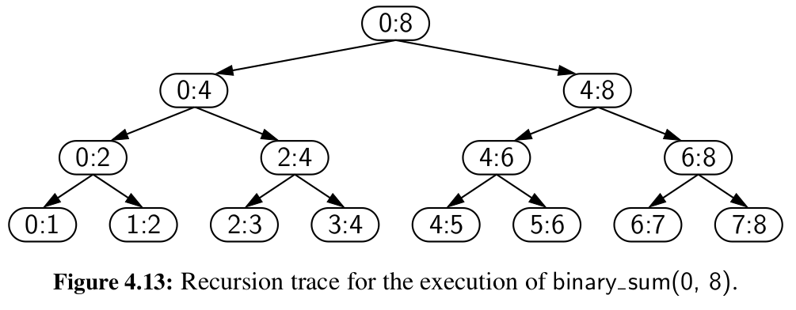

Linear recursion is a type of recursion where a function **calls itself once** and the problem is broken down into smaller subproblems of the same kind but with different input. An example of this would be finding the factorial of a number, where the function calls itself with the input being the number minus one.

Binary recursion is a type of recursion where a function **calls itself twice**, and the problem is broken down into two smaller subproblems of the same kind. An example of this would be the Fibonacci sequence, where the function calls itself twice with the input being the previous two numbers in the sequence.

Multiple recursion is a type of recursion where a function **calls itself multiple times**, and the problem is broken down into multiple smaller subproblems of the same kind. An example of this would be the Tower of Hanoi problem, where the function calls itself three times with the input being the three rods in the problem.

However, that does not necessarily determine the running time of the algorithm. For example, binary search is an example of linear recursion (as it only calls itself once per function call, either on the left half of the list, or the right half of the list), but it's running time is O(log(n)), not linear.

On the other hand, this binary sum algorithm is an example of binary recursion, but it actually makes 2n - 1 calls, so its running time is O(n), linear:

```
def binary_sum(numbers: Sequence[int | float], start: int = 0, stop: Optional[int] = None):
  if stop is None:
    stop = len(numbers) - 1

  if stop - start == 0:
    return numbers[stop]
  else:
    mid = (start + stop) // 2
    return binary_sum(numbers, start, mid) + binary_sum(numbers, mid + 1, stop)
```

