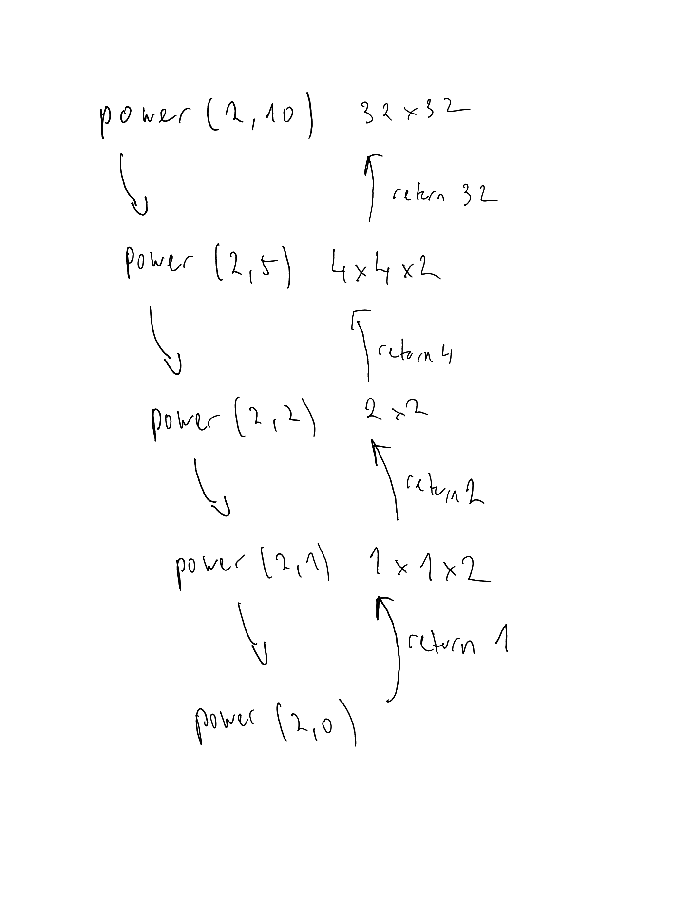

# Repeated squaring algorithm for computing large powers - comparing iterative and recursive approaches

#### Sources

- this algorithm is discussed in *the* book - Data Structures and Algorithms in Python by Goodrich etc, chapter 4. Page 173 shows the recursive versions, and the end of chapter exercises ask you to come up with the iterative version.
- [This website](https://www.rookieslab.com/posts/fast-power-algorithm-exponentiation-by-squaring-cpp-python-implementation) has an iterative implementation, and interesting discussion on the algorithm

### Brief background

Repeated squaring is an efficient algorithm for finding large powers of numbers. Our initial, naive approach to an algorithm for exponentiation might be something like this:

```
def power(x: int, n: int) -> int:
  result = 1
  while n > 0:
    result = result * x
    n -= 1
  return result
```

We just multiply the number by itself n times. The problem with this implementation is that it's running time is `O(n)` in respect to the power to which the number is raised. So if we wanted to compute something to the power of a billion for example, this algorithm would be pretty slow.

We can do better with repeated squaring. The idea is to divide the power in half at each step, and then multiply what we get by itself. Let's use 2^10 as an example.

```
2^10
Try to divide power by 2
2^10 = (2^2)^5 = 4^5
Now our problem is to find 4^5.
Try to divide power by 2
The power is odd, so we can't divided it by two. But we can represent it as:
4^5 = 4 * 4^4
Now our power is even, we can divide it by two:
4 * 4^4 = 4 * (4^2)^2
Now our problem is to find 4 * 16^2, which is just 4 * 16 * 16 
```

So basically, if the power is even, we can just square the base, and divide the power by two. If the power is odd, we factor out the base, so we are left with an even power, and again we can just square the base and divide the power by two.

### Implementations

#### Recursive

```
def power(x: int, n: int) -> int:
  """Compute x to the power of n using repeated squaring - recursive"""
  if n == 0:
    return 1

  partial = power(x, n // 2)
  result = partial * partial
  if n % 2 == 1:
    result = result * x
  
  return result
```

#### Iterative

```
def power(x: int, n: int) -> int:
  result = 1
  while n > 0:
    if n % 2 == 1:
      result = result * x
    x = x * x
    n = n // 2
  return result
```

### Explanations

#### Recursive

Let's illustrate and explain how both of the implementations work, using some examples. Let's use the example of `power(2, 10)`. This recursive trace shows how the functions calls itself until it hits the base case, and then either just squares the result it gets from the recursive call, or squares it and multiplise it by the base:




#### Iterative

Let's use the same example of `power(2,10)`

The algorithm will first assign a value of 1 to the result, then it will enter the while loop.

**First iteration:**

- n is even
- we square the base
- we divide the power by two

The result so far is 1
The base (x) is now 4
The power (n) is now 5

**Second iteration**

- n is odd
- we multiply the result we have so far by the current base, thereby effectively decrementing n by one and making it even
- we square the base
- we divide the power by two

The result so far is 4
The base (x) is now 16
The power (n) is now 2
**Third iteration**

- n is even
- we square the base
- we divide the power by two

The result so far is 4
The base (x) is now 256
The power (n) is now 1

**Fourth iteration**

- n is odd
- we multiply the result we have so far by the current base, thereby effectively decrementing n by one and making it even
- we square the base
- we divide the power by two

The result so far is 1024
The base (x) is now 65536
The power (n) is now 0

We have exited the while loop and return the result of 1024.

As we can see, this code implements the algorithm described in the background. If we have an even power, we just square the (current) base we have and divide the power by two. If we have an odd power, we have to factor out (multiply by) the current base, so we can decrement the power by one and make it into an even power. The `result` variable in the algorithm is used as a kind of accumulator, accumulating all of these multiplications for the odd cases. Meanwhile, the `x` variable is used to keep squaring. In the end, we need to then multiply the accumulation of the factors of the odd cases by the result of the squaring to get the final answer and return it. As a final point - it may seem as though in cases where n is even (and a power of two), that we may never reach the condition:

```
if n % 2 == 1:
      result = result * x
```

However, when we keep doing integer divison on any number, we will eventually hit the case where n = 1, which would trigger the above condition.