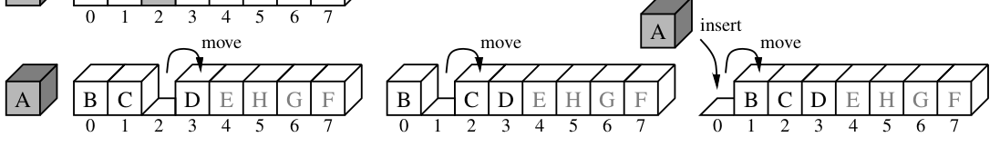
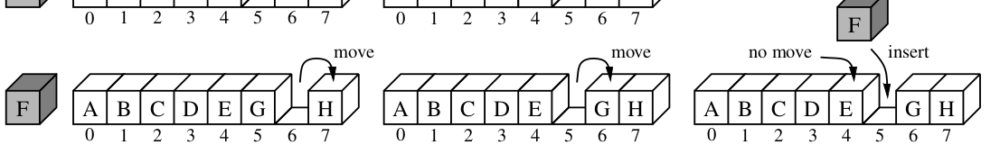

# Insertion sort

## Implementation

```
def insertion_sort(A: list) -> None:
  for k in range(1, len(A)):
    curr = A[k]
    j = k
    while j > 0 and curr < A[j - 1]:
      A[j] = A[j - 1]
      j -= 1
    A[j] = curr
```

## Explanation

As the name of the algorithm suggests, the algorithm works by iterating over the array, and inserting each item into the proper location it belongs. The algorithm uses nested for loops. The outer loop passes once over the entire array, from the beginning to end (left to right). The inner loop compares the current element we are looking at in the outer loop to the elements to its left. It keeps looking left as long as the current element is smaller than the elements to its left. The invariant of this algorithm is that the sub-array to the left of the current element is aleways sorted. The mechanism through which the algorithm works is by shifting the elements to the right. We can imagine that the current element we are looking at is 'taken out' of the array, leaving a gap. And while the current element is smaller than the element to its left, we keep moving the elements to the right, thus moving the gap to the left. This gap is where we will end up inserting the current element. See the image below for illustration: 




Here, element A was originally in position 3. And as long as element A is smaller than the element to its left, we keep moving the element by one position to the right.


Another illustration:

