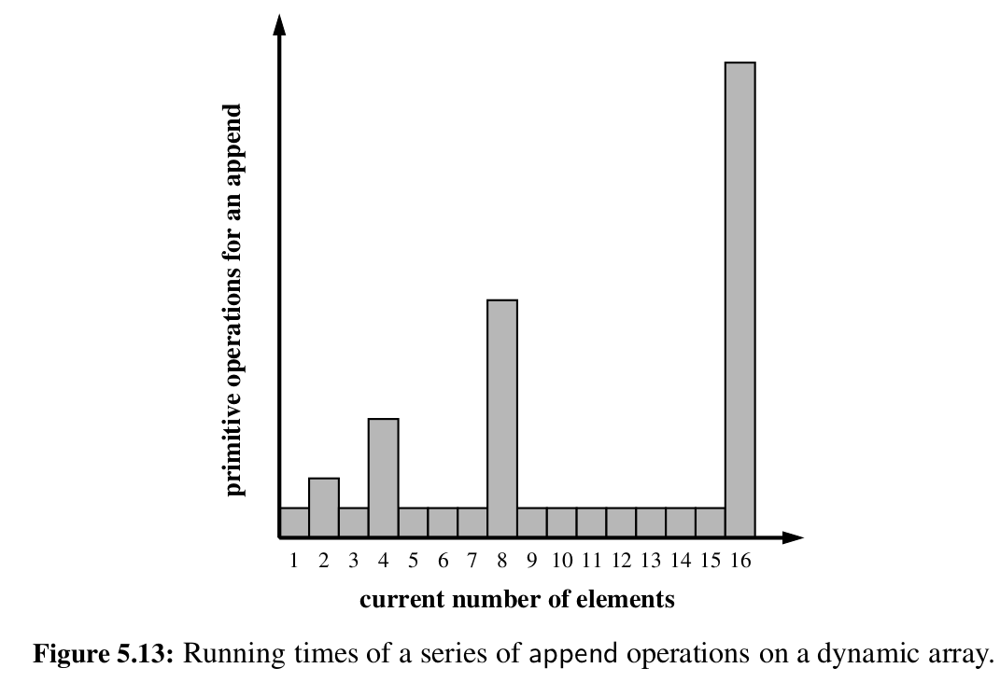

# Python's `list`


Python provides us with a built in `list` class, to which we can append items seemingly without limit. This means that it must be using some 'magic behind the scenes`, because if we want to store a series of values, we must ask the computer for a specific amount of memory, which it then allocates us. But when we declare a python list, we don't have to say up front how many values we want to store, and we are also not limited in the number of values that we can store.

The usual way to implement a dynamic array is to have an underlying array of a specific size in which we store the values, and when we need to store more values when we're already at full capacity, we create a new, bigger array, and copy the values over. We can actually do an experiment whose results suggest that this is in fact how Python implements its `list`:

```
import sys

data = []

n = 19

for k in range(n):
  length = len(data)
  size = sys.getsizeof(data)
  print(f"Length: {length}, size in bytes: {size}")
  data.append(None)
```

The output of the above code is:

```
Length: 0, size in bytes: 56
Length: 1, size in bytes: 88
Length: 2, size in bytes: 88
Length: 3, size in bytes: 88
Length: 4, size in bytes: 88
Length: 5, size in bytes: 120
Length: 6, size in bytes: 120
Length: 7, size in bytes: 120
Length: 8, size in bytes: 120
Length: 9, size in bytes: 184
Length: 10, size in bytes: 184
Length: 11, size in bytes: 184
Length: 12, size in bytes: 184
Length: 13, size in bytes: 184
Length: 14, size in bytes: 184
Length: 15, size in bytes: 184
Length: 16, size in bytes: 184
Length: 17, size in bytes: 248
Length: 18, size in bytes: 248
```

From the output it seems that when we add the first value to our list, python creates an underlying array with room for 4 elements. And then whenever it reaches full capacity, it doubles the size of the underlying array. 

## Amortized analysis

The strategy of replacing the underlying array with a bigger array leads to the fact that the time taken for an append operation is not consistent. If we add an element to our list when the underlying array has capacity for more elements, only a single primitive operation is needed - setting a value at the given index of the underlying array. This is an O(1) operation, since we can index into an array in constant time. However, if we add an element to the list when the underlying array is full, we need to create a new array and then copy all of the values in the existing underlying array to the new, bigger array. This will obviously take n steps, if we consider n to be the number of elements in the underlying array.



This approach might seem inefficient at first, as an append operation has O(n) comoplexity in the worst case, but we can use a technique called *amortization* to show that this approach is actually quite efficient when we perform many append operations. 

In amortized analysis we average out the cost of each operation over time, rather than analyzing the cost of an individual operation. Let's assume that each append operation has a cost of 1 cyber-dollar / operation, and that growing the underlying array from size k to size 2k requires k cyber-dollars / operations (because we need to copy over all k items from the current underlying array to the new array of size 2k). We can then charge each append operation 3 cyber-dollars / operations. Therefore we are overcharging each append operation which does not cause the underlying array to overflow by 2 cyber-dollars. We can think of these cyber-dollars as stored in the cells in which the element was inserted. An overflow occurs when the array has 2^i elements and the size of the underlying array is 2^i. Therefore, doubling the size of the array will require 2^i dollars, as we need to copy all 2^i elements. Fortunately, these 2^i dollars are stored in cells 2^(i-1) up to 2^i - 1.Therefore, we have a valid amortization scheme in which each opeeration is charged three cyber-dollars and the computing time is paid for. We can pay for n append operations using 3n cyber-dollars, therefore the amortized running time of n append operations is O(n).

While the above proof relies on the array being doubled in size each time when it reaches full capacity, it can be adjusted for any geometrically increasing progression of array sizes. We could for example increase the array size by 25% each time it is full, or triple the array size, or use any other constant factor. The trade off is that larger factors will lead to less infrequent resize events, but they waste more memory by keeping more empty cells. But we can prove an amortized O(1) bound for any constant factor.

On the other hand, using a fixed increment for each size, giving an arithmetic progression rather than a geometric one would give a O(n^2) complexity for n append operations. 