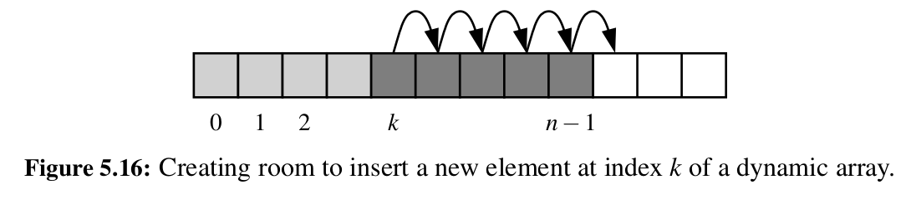
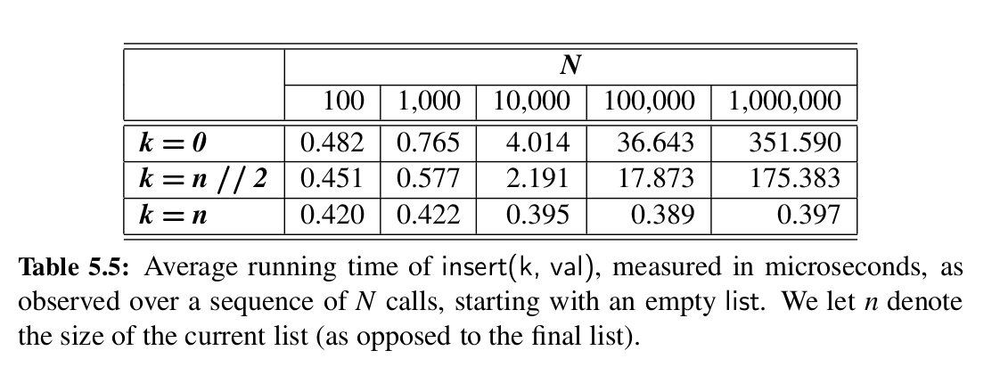
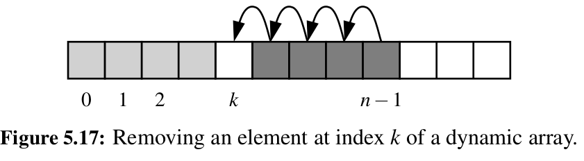

# Efficiency of Python's Sequence types

## `list` and `tuple` (non-mutating behaviors)

| Operation           | Running time |
| ------------------- | ------------ |
| `len(data)`         | `O(1)`       |
| `data[j]`           | `O(1)`       |
| `data.count(value)` | `O(n)`       |
| `data.index(value)` | `O(k+1)`     |
| `value in data`     | `O(k+1)`     |
| equality/comparison | `O(k+1)`     |
| `data[j:k]`         | `O(k-j+1)`   |
| `data1 + data2`     | `O(n1+n2)`   |
| `c*data`            | `O(cn)`      |

### Constant time operations

- `len(data)` is constant time because the list instance stores the length as a variable that it can immediately access
- `data[j]` is constant time due to access to the underlying array

### Searching for occurences

- `data.count(value)` is O(n) because it has to go through the entire list to count all occurences
- `data.index(value)` and `value in data` is O(k+1) where k is the leftmost index at which the value can be found in the list. Because the function can exit the loop once it finds the first occurence of the value. In the worst case, when the given value is not present in the list, k = n - 1, and so the complexity in the worst case is O(n), since the function has to look at all the values

### Equality/comparison

- is O(k+1) where k is the index of the leftmost value which is the first difference between the two lists. In the worst case, k = n - 1, giving O(n) complexity.

### Creating new instances

- `data[j:k]` creates a new list and has to copy over all the references in the range j:k, so it takes time proportional to the size of the range
- `data1 + data2` creates a new list and has to copy over all the references in both of the lists, so it takes time proportional to the sum of the sizes of the two lists
- `c*data` creates a new list and has to copy all each member of the list c times, so it takes time proportional to c * n

## Mutating behaviours

| Operation            | Running time |
| -------------------  | ------------ |
| `data[j] = val`      | `O(1)`       |
| `data.append(val)`   | `O(1)` *     |
| `data.insert(k, val)`| `O(n-k+1)` * |
| `data.pop()`         | `O(1)` *     |
| `data.pop(k)`        | `O(n-k)` *   |
| `data.remove(val)`   | `O(n)` *     |
| `data.extend(data2)` | `O(n2)` *    |
| `data.reverse()`     | `O(n)` *     |
| `data.sort()`        | `O(nlogn)`   |

\* amortized cost

### Adding elements to a list

- `data.append(val)` takes O(n) time in the worst case (when the underlying array is full and all its elements have to be copied over to a new, bigger array) and O(1) in the amortized sense
- `data.insert(k, val)` inserts a value into the list at index k. This has time complexity of O(n-k+1) because during this operation, all the values from index k onwards have to be shifted by one slot to make room at index k. Inserting near the end of the list is therefore faster, because fewer values have to be shifted. Inserting at the beginning of the list requires all the values to be shifted by one, and so it would have O(n) time complexity.



Results of an experiment of inserting at the beginning, middle and end of a list:



As we can see, the experiment is consistent with the explanation/illustration of how the `insert` method works. Namely, we can see that inserting at the middle of the list takes about half as much time as inserting at the end of the list. We can also see that while inserts at the beginning and at the end increase linearly with the increase in the size of the list, inserts at the end take the same time independent of the size of the list, confirming the O(n-k+1) time complexity.

### Removing elements from a list

- `data.pop()` without an argument provided will by default remove the last value in the list. This is an O(1) operation, because we don't need to shift any of the other elements, we simply change the value at the last index. Though in the worst case, it can be O(n), because we might be at the point where the underlying array gets shrunk to a smaller one, so it is O(1) in the amortized sense
- `data.pop(k)` removes the element at index k. This operation is O(n-k), because all the elements in front of k need to be shifted left by one, so that we don't just have a gap in our list. Therefore, again, it is faster to `pop` elements near the end of the list, because in that case fewer items need to be shifted.



- `data.remove(val)` removes the first (leftmost) occurence of `val` from the list (or raises ValueError if `val` is not in list). Therefore, this operation always has complexity O(n). If the value is not found in the list, then we have to scan the whole list to find that out. If the value is found at index k, then we need to scan k+1 values, and then the shift n-k-1 values in front of the value found at index k.

### Extending a list

- `data.extend(data2)` appends all the values in the list `data2` to the list `data`. This has time complexity proportional to the length of `data2`, therefore O(n2) where n2 is the length of data2

### Constructing new lists

Let's examine two ways of constructing new lists in python - list comprehensions and the multiplication operator.

```
# list of first 10 squares

squares_1 = []

for k in range(1, n+1):
  squares_1.append(k*k)

squares_2 = [k*k for k in range(1, n+1)]
```

Using a list comprehension is much faster. One of the reasons is that we don't have to load the `append` method and then suspend and resume the function frame of our main function when using list comprehension.

Let's look at list multiplication next:

```
n = 100

zeros_1 = []

for _ in range(n):
  zeros_1.append(0)

zeros_2 = n * [0]
```

Again, this is faster because we don't have to load, call and suspend the `append` method repeatedly. 