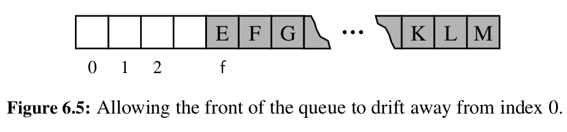

# Implementing a queue in Python

While implementing a stack in Python is very easy, because the `list` class already gives us methods which can add to the end and remove from the end with O(1) complexity, a queue is more difficult.

The naive approach to implement a queue using a list would be to just use `append` to add to the back of the queue and use `.pop(0)` to remove from the front of the queue. The problem is that `.pop(0)` has O(n) time complexity, because all the items in front of the first item in the underlying array must be shifted by one position to the left. So this implementation would be inefficient.

A naive solution to this problem would be to just retrieve the item at the front of the queue, set the value at that position to `None` and return the item (while keeping track of which index in the list is currently the front of the queue). The problem with this solution is that this will make the values in our underlying list drift to the right:

And we would end up using a list with a much greater capacity than the actual number of items currently in the queue, which is also rather inefficient. The size of the list would be equal to the total number of `enqueue()` operations done since the creation of the queue, which could end up being much greater than the current number of items in the queue.

The solution to this problem is to use a circular array, using modular arithmetic. This way the front of the queue can keep drifting to the right, but once it reaches the end of the array, it wraps around to the front again.
