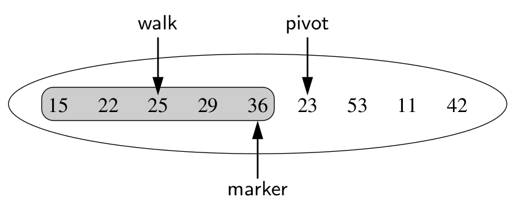
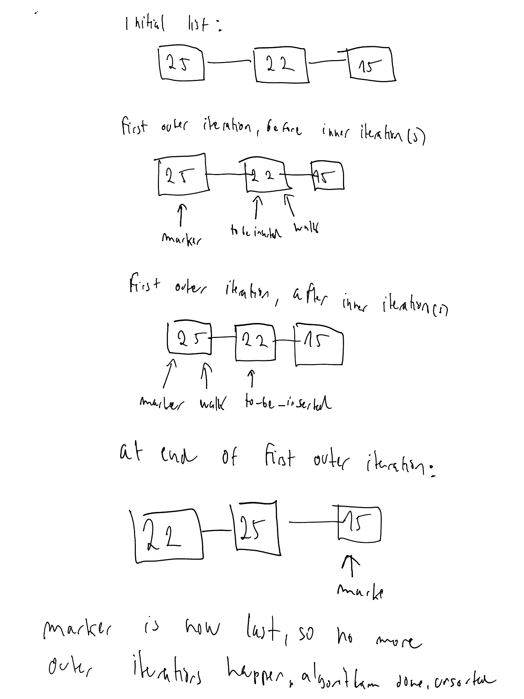

# Insertion sort of a linked sequence

## The algorithm

```
def insertion_sort(seq: PositionalList) -> None:
    """
    Use insertion sort to sort a doubly linked list in place
    """
    if len(seq) < 2:
        return
    marker = seq.first()
    while marker != seq.last():
        to_be_inserted = seq.after(marker)
        value_to_be_inserted = to_be_inserted.element()
        if value_to_be_inserted > marker.element():
            marker = to_be_inserted
        else:
            walk = marker
            while (
                walk != seq.first() 
                and seq.before(walk).element() > value_to_be_inserted
            ):
                walk = seq.before(walk)
            seq.delete(to_be_inserted)
            seq.add_before(walk, value_to_be_inserted)
```

## Explanation

The basic idea of insertion sort is to iterate over the values in the list, and for each values, to place it in its correct position to its left. So an invariant of this algorithm is that the values to the left of the currently iterated value are sorted.

The algorithm uses three key variables:
- `marker` - this marks what portion of the list has been sorted so far. The `marker` position and everything to its left is in sorted order. We initialize `marker` to be the first position of the list.
- `to_be_inserted` (my name) or `pivot` (book name) - this is the value we are currently trying to insert into the left, already sorted part of the list. On every iteration, we set this to be the position after `marker`.
- `walk` - this is a helper variable that is used to iterate over the values to the left of `to_be_inserted`. We initialize this variable to be equal to `marker` on eaach iteration



The main, outer loop of the algorithm is a while loop which checks whether `marker == seq.last()`. This makes sense, since `marker` marks the portion of the list which is sorted, and so once marker is equal to the last position of the list, we're done.

We then initialize `to_be_inserted` on each iteration of the loop, as described above.

Then, we first check whether the value at `to_be_inserted` is greater than the value at `marker`. 

If it is, we advance marker by setting its values to `to_be_inserted`. This is actually the only way that `marker` is advanced in the algorithm. 

If it's not, we initialize `walk` at the same position as `marker`. Once this case is entered, then `to_be_inserted` is going to move before `marker` at the very least, even if `walk` is not advanced any further to the left. That's why we first need to check whether `to_be_inserted` is greater than `marker`.

## Common errors/wrong alternative solutions

Let's explore the problems with alternative solutions:

- alternative solution: initialize `walk` at `to_be_inserted` instead and don't check whether `to_be_inserted` is already in the right place

```
def insertion_sort_attempt_2(seq: PositionalList):
    if len(seq) < 2:
        return
    
    marker = seq.first()
    while marker != seq.last():
        to_be_inserted = seq.after(marker)
        value_to_be_inserted = to_be_inserted.element()
        walk = to_be_inserted
        while walk != seq.first() and value_to_be_inserted < seq.before(walk.element()):
            walk = seq.before(walk)
        seq.add_before(walk, to_be_inserted.element())
        seq.delete(to_be_inserted)
        marker = seq.after(marker)
```

The problem with this implementation is what happens when we approach the end of the list. When we are at the iteration of the outer while loop where `to_be_inserted` and `walk` are pointing at the penultimate position in the list. At the end of that iteration, we advance `marker` to the last position in the list. But that's the condition that the outer while loop is checking for, and so it will not run, and leave the last element in the list unsorted.

