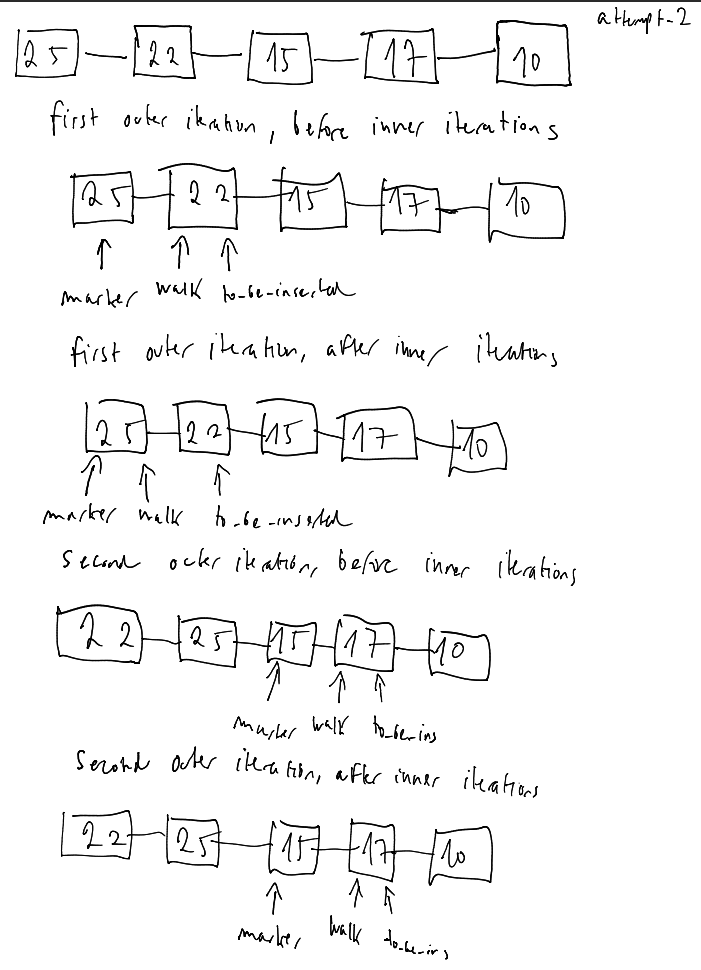
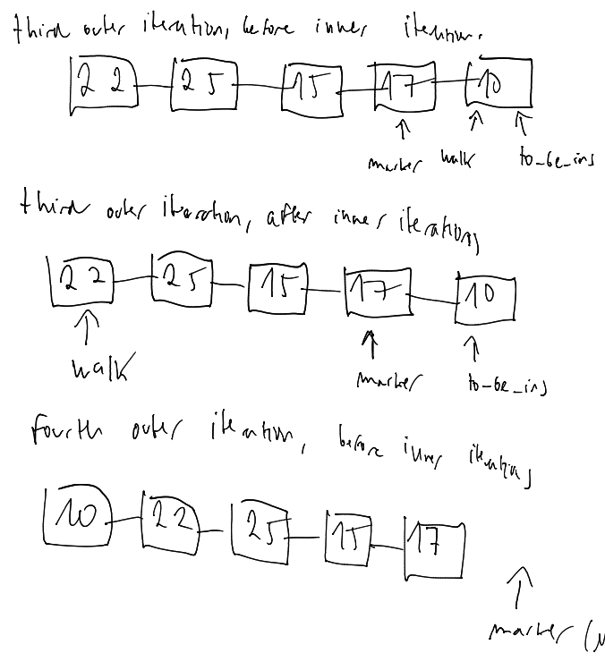

# Insertion sort of a linked sequence

## The algorithm

```
def insertion_sort(seq: PositionalList) -> None:
    """
    Use insertion sort to sort a doubly linked list in place
    """
    if len(seq) < 2:
        return
    marker = seq.first()
    while marker != seq.last():
        to_be_inserted = seq.after(marker)
        value_to_be_inserted = to_be_inserted.element()
        if value_to_be_inserted > marker.element():
            marker = to_be_inserted
        else:
            walk = marker
            while (
                walk != seq.first() 
                and seq.before(walk).element() > value_to_be_inserted
            ):
                walk = seq.before(walk)
            seq.delete(to_be_inserted)
            seq.add_before(walk, value_to_be_inserted)
```

## Explanation

The basic idea of insertion sort is to iterate over the values in the list, and for each values, to place it in its correct position to its left. So an invariant of this algorithm is that the values to the left of the currently iterated value are sorted.

The algorithm uses three key variables:
- `marker` - this marks what portion of the list has been sorted so far. The `marker` position and everything to its left is in sorted order. We initialize `marker` to be the first position of the list.
- `to_be_inserted` (my name) or `pivot` (book name) - this is the value we are currently trying to insert into the left, already sorted part of the list. On every iteration, we set this to be the position after `marker`.
- `walk` - this is a helper variable that is used to iterate over the values to the left of `to_be_inserted`. We initialize this variable to be equal to `marker` on eaach iteration


The main, outer loop of the algorithm is a while loop which checks whether `marker == seq.last()`. This makes sense, since `marker` marks the portion of the list which is sorted, and so once marker is equal to the last position of the list, we're done.

We then initialize `to_be_inserted` on each iteration of the loop, as described above.

Then, we first check whether the value at `to_be_inserted` is greater than the value at `marker`. 

If it is, we advance marker by setting its values to `to_be_inserted`. This is actually the only way that `marker` is advanced in the algorithm. 

If it's not, we initialize `walk` at the same position as `marker`. Once this case is entered, then `to_be_inserted` is going to move before `marker` at the very least, even if `walk` is not advanced any further to the left. That's why we first need to check whether `to_be_inserted` is greater than `marker`.

## Common errors/wrong alternative solutions

Let's explore the problems with alternative solutions:

```
def insertion_sort_attempt_2(seq: PositionalList):
    if len(seq) < 2:
        return
    
    marker = seq.first()
    while marker != seq.last():
        to_be_inserted = seq.after(marker)
        value_to_be_inserted = to_be_inserted.element()
        walk = to_be_inserted
        while walk != seq.first() and value_to_be_inserted < seq.before(walk.element()):
            walk = seq.before(walk)
        seq.add_before(walk, to_be_inserted.element())
        seq.delete(to_be_inserted)
        marker = seq.after(marker)
```

In this implementation, we don't have separate conditional branches dependent on whether `to_be_inserted > marker`. Instead, we initialize `walk` at `to_be_inserted`, and advance marker forward on each iteration. It seems like this should work, because if the value we want to insert is greater than marker (ie it is already in place), then `walk` will stay at `to_be_inserted`, and we end up inserting the value to_be_inserted in front of itself (making a copy) and then deleting the original. And then we move on further. However, there are several problems with this implementation.

One of the problems with this implementation is what happens when we approach the end of the list. When we are at the iteration of the outer while loop where `to_be_inserted` and `walk` are pointing at the penultimate position in the list. At the end of that iteration, we advance `marker` to the last position in the list. But that's the condition that the outer while loop is checking for, and so it will not run, and leave the last element in the list unsorted.


The problem stems from how `marker` is advanced. Marker is advanced to the next position, which actually makes it skip an element. Consider the example above. `marker` is initially pointing at 25. We consider the element in front, 22, for insertion. We insert it before 25. The next element we should consider for insertion is 15. But we moved 22 from being in front of 25, to behind 25. So if we advance marker to 15, we will actually skip considering 15 for insertion.

***Only advance `marker` to the right if the element to the right is greater than `marker`.***

In the shown wrong implementation, even changing the condition of the outer while loop to `while marker is not None` will not help - `insertion_sort_attempt_3`. Although this would make the function execute an extra iteration, it would also lead to an Exception. Because `to_be_inserted` is initialized to be the element after `marker`. So if the loop executes when `marker` is the last element, `value_to_be_inserted` will be initialized to the element after the last element, which is `None`.

```
def insertion_sort_attempt_3(seq: PositionalList):
    if len(seq) < 2:
        return
    
    marker = seq.first()
    while marker is not None:
        to_be_inserted = seq.after(marker)
        value_to_be_inserted = to_be_inserted.element()
        walk = to_be_inserted
        while walk != seq.first() and value_to_be_inserted < seq.before(walk).element():
            walk = seq.before(walk)
        seq.add_before(walk, to_be_inserted.element())
        seq.delete(to_be_inserted)
        marker = seq.after(marker)
```

However, the problem does not just occur near the end of the list. Consider what happens in the following case, where the list is in an initial state of `[25, 22, 15, 17, 10]`. First, we will explore the `insertion_sort_attempt_2` case:




This illustrates nicely the problem with how `marker` is advanced. Look at what happens during the first iteration. `marker` starts at 25, and `to_be_inserted` and `walk` are set to 22. 22 is then inserted before 25. Then, `marker` is advanced to 15. This is a problem, because `to_be_inserted` is now set to 17. We have skipped over 15, we never considered it for insertion, and so it remains out of position.

The implementation actually makes a mistake any time when `to_be_inserted` is less than marker. Because `to_be_inserted` will be inserted somewhere before `marker`, and when `marker` is then advanced, it is effectively advance by two positions, not by one.

We can also again see the problem near the end of the list. In this example, this actually leads to an Exception, rather than just leaving the last item unsorted. When we get to 17, in the penultimate position as `marker` and consider 10 as `to_be_inserted`. We then move 10 to the beginning of the list. And `marker` is advanced further. However, because 10 was moved, there is no item in front of 17 anymore, and so `marker` becomes `None`, which then raises an Exception. This is actually kind of the better case, because we know right away that the implementation is broken.

On the other hand, in the `insetion_sort_attempt_3` case, because the condition is `while marker is not None`, no Exception is raised. Because after the marker is advanced from 17 to None, the algorithm just ends, without raising an Exception, so the bug is more subtle. But the output is obviously wrong - `[10, 22, 25, 15, 17]`.


```
def insertion_sort_attempt_1(seq: PositionalList):
    if len(seq) < 2:
        return
    
    marker = seq.first()
    while marker != seq.last():
        to_be_inserted = seq.after(marker)
        walk = marker
        while walk != seq.first() and to_be_inserted.element() < walk.element():
            walk = seq.before(walk)
        seq.add_before(walk, to_be_inserted.element())
        seq.delete(to_be_inserted)
        marker = seq.after(marker)
```

Next, let's break down whether we should be checking the element before walk, or walk itself. This is explored in `insertion_sort_attempt_1`.

This algorithm actually still has the same problem with the advancing of marker. We can see that the same, undesirbale thing happens on the first iteration. As 22 is moved before 25, `marker` is then advanced to 15, therefore skipping 15 as an item for consideration `to_be_inserted`.

However, this implementation is actually even more wrong. Consider what happens on the next iteration. Because we are initializing walk at marker, and then inserting before walk, we actually always end up moving `to_be_inserted` before at least one element. Whereas in `attempt_2`, while the element was also always moved, it would just be moved before itself in these cases (a copy is inserted before the original, and then the original is deleted, so it remains in place effectively).

## Takeaway

- Have separate cases for when `to_be_inserted` is greater than or less than `marker`, ie for when `to_be_inserted` is going to move at least one position and when not
- This is (in part) because we only want to advance marker when `to_be_inserted` is not moving, so that we don't accidentally skip a position for consideration of `to_be_inserted`. Because if we advance `marker` after the position which was originally in front of `marker` has been moved behind `marker`, we are effectively moving `marker` by two positions, and therefore skipping a position.
- Initialize `walk` at `marker` in case when we are going to be moving `to_be_inserted` by at least one position. This is because we know for sure that `to_be_inserted` is going to move, so there is no need to initialize `walk` at `to_be_inserted`
- Make sure that the condition to advance `walk` (or rather, move it backward) includes both `walk != seq.first()` and `value_to_be_inserted < seq.before(walk).element()`. Because we are going to be inserting the item before `walk`. So when we move `walk` one position back, we are going to be inserting before the position before walk. So that's what we need to checking against, not `walk.element()` itself. 