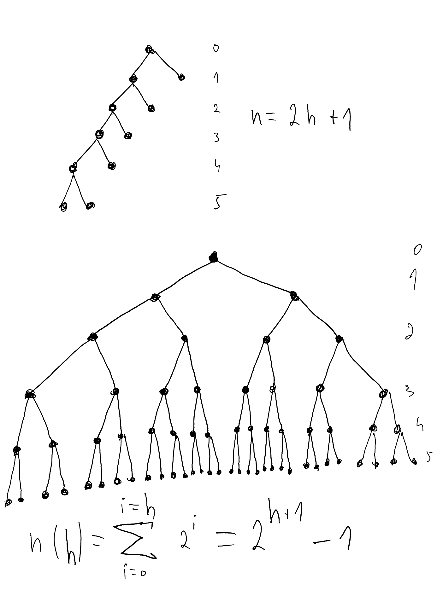

# Answers to chapter 8 written exercises

## 8.1

a) `/user/rt/courses/`
b) 
- `/user/rt/courses/`
- `/cs016/`
- `homeworks/`
- `programs/`
- `papers/`
- `demos/`
- `projects/`
- `cs252/`

c) 9
d) 1
e) `grades`, `programs`
f) 
- `projects/`
- `papers/`
- `demos/`
- `buylow`
- `sellhigh`
- `market`

g) 3
h) 4

## 8.2

A tree where all nodes form a single branch (each node has one child).

## 8.3

Because the depth of a leaf depends on the number of levels above, and the height of a tree depends on the number of levels below. Therefore, the height is equal to the maximal depth. Because the height would be counted by counting the levels from the root down to the deepest position. And the depth would be counted by counting the levels from the deepest postiion up to the root.

## 8.4

O(n), where n is the number of positions in the subtree rooted at the given position.

## 8.6

Use dummy nodes. Where the improper tree has one child, add another child, with `None` as its element.

## 8.7

The minimum number of external nodes is 1 (a linear tree, resembling a linked list)

The maximum number of external nodes is n / 2. This is in the case where the tree is proper/fill, except for a single node at the deepest level. In this case, there are 2^h - 1 external nodes, all on the deepest level. And there are 2^(h+1) - 2 total nodes in such a tree.

The maximum and minimum numbers of internal nodes can then just be deduced as n minus the the minimum and maximum numbers of external nodes. 

So the maximum number on internal nodes is n - 1.

And the minimum number of internal nodes is n / 2.

## 8.8

The minimum number of external nodes for a binary tree of height h is h + 1. This is the case where we have two nodes at each level (except the root), where one of the nodes has two children and the other node has no children. Until we get to the last level, where both nodes have zero children.

The maximum number of external nodes occurs when we have a full binary tree, where all nodes have two children, up until the deepest level. In this case, the number of external nodes is equal to the number of nodes at the deepest level, which is 2^h.

## 8.9

As the base case, we have a binary tree with just a single root node. For this case, the formula obviously holds. Any other proper binary tree is formed from this tree by adding two nodes to an external node. Through such an operation, two external nodes will be added, and one will be removed (or rather, it will cease to be an external node, and become an internal node, as it now has two children). Therefore, the formula still holds. 

## 8.16

A tree with n nodes can have at most (n-1) levels, if we consider the root the 0th level. For a tree with h levels, the highest possible number of nodes is 2^(h+1)-1. Therefore, a tree with n-1 levels can have at most 2^n - 1 nodes. And considering that the nodes are counted from zero - f(root) = 0, then the highest number a node can have is 2^n - 2.

## 8.21

-, /, x, +, 3, 1, 3, +, -, 9, 5, 2, x, 3, -, 7, 4, 6, + 

## 8.22

3, 1, +, 3, x, 9, 5, -, 2, +, /, 3, 7, 4, -, x, 6, +, -

## 8.23

For a tree with more than one node, a pre-order traversal can never visit the nodes in the same order as a post-order traversal, because a pre-order traversal will always start at the root, whereas a post-order traversal can never start at the root, as it visits sub-trees first.

On the other hand, a pre-order and post-order traversal can visit the nodes in reverse order. For example a tree with two nodes will produce opposite order fro pre-order and post-order traversals.

## 8.24

For a proper binary tree with more than one node, the root must have two children. Let's call the root a, and the subtrees which are the left and right children of the root T1 and T2 respectively. 

In this case, a pre-order traversal will first visit the root, then all the nodes in the T1 subtree, and then all the nodes in the T2 subtree. On the order hand, a post-order traversal will first visit all the nodes in T1, then all the nodes in T2, and then the root. So the order for pre-order will be root, T1, T2. For post-order, it's T1, T2, root. As T1 comes before T2 in both, the traversal cannot visit the nodes in reverse order. 

## 8.25

{1} before the first pass
{2,3,4} before the second pass
{3,4,5,6} before the third pass
{4,5,6,7,8,9,10,11} before the fourth pass
{5,6,7,8,9,10,11,12,13,14,15,16} before the fifth pass
After that, the while loop will run, removing one item at a time, not adding any new items, until it is empty.

## 8.31

We can easily show that the formula holds for the base case of a tree with a single root node.

Any proper binary tree can then be made by incrementally adding two nodes as children of an existing external node.

Therefore, it is sufficient to show that this formula still holds after that operation.

Attaching two nodes at a node which has depth d will:
- increase E(T) by 2(d+1), as we are adding two new external nodes, which will have depth d+1
- decrease E(T) by d, since the node to which we are attaching the two new nodes will cease being an external node, and become an internal node instead
- increase I(T) by d, for the same reason stated above
- increase n by two, since we are adding two new nodes

So if we have the following before adding two nodes:

E(T) = I(T) + n - 1

Then after adding two nodes we will have:

E(T) + 2(d+1) - d = I(T) + d + n + 2 - 1

which we can rearrange to

E(T) + d + 2 = I(T) + d + n + 2 - 1

and then we can cancel d + 2 on both sides:

E(T) = I(T) + n - 1

showing that the equality holds after adding two nodes anywhere in the tree.

## 8.32

Let T be a (not necessarily proper) binary tree with n nodes, and let D be
the sum of the depths of all the external nodes of T . Show that if T has the
minimum number of external nodes possible, then D is O(n) and if T has
the maximum number of external nodes possible, then D is O(nlogn).

To minimize the number of external nodes in an improper binary tree, we form a tree with a single branch, resembling a linked list. In such a tree, we only have one external node, which has depth n - 1, therefore D is O(n).

To maximize the number of external nodes in an improper binary tree, we form a full proper binary tree. Such a tree will have all its external nodes on the last level. There will be 2^d of those nodes in terms of the depth, and at the same time, (n + 1) / 2 in terms of n. So we have roughly n / 2 external nodes, each of which has depth of log(n) - 1. Giving us O(nlog(n)).

## 8.34

Starting from a single node tree with just the root, we can build any such tree by attaching three nodes to an existing external node. Each such operation will cause a net increase of the number of external nodes by 2. Since we are adding 3 new external nodes, and the node to which we are attaching the new nodes will cease being an external node. The operation will also increase the number of internal nodes by 1, for the same reason.

So we initially have:

nE = 2nI + 1

By applying the operation, we get:

nE + 2 = 2(nI + 1) + 1

Which we can simplify back to the original equation.

## 8.35

Looking at the stack when called on same tree, the tree from Figure 8.22

recurse(A, A) -> True to recurse(B, B), pop off
recurse(B, B)
recurse(F, F)
recurse(H, H)

recurse(C, C) -> return True to recurse(D, D), pop off
recurse(D, D)
recurse(B, B)
recurse(F, F)
recurse(H, H)

recurse(E, E) -> return True to recurse(D, D), pop off
recurse(D, D)
recurse(B, B)
recurse(F, F)
recurse(H, H)

recurse(D, D) -> return True to recurse(B, B), pop off
recurse(B, B)
recurse(F, F)
recurse(H, H)

recurse(B, B) -> return True to recurse(F, F), pop off
recurse(F, F)
recurse(H, H)

recurse(G, G) -> return True to recurse(F, F), pop off
recurse(F, F)
recurse(H, H)

recurse(F, F) -> return True to recurse(H, H), pop off
recurse(H, H)

recurse(I, I) -> return True to recurse(J, J), pop off
recurse(J, J)
recurse(L, L)
recurse(H, H)

recurse(K, K) -> return True to recurse(J, J), pop off
recurse(J, J)
recurse(L, L)
recurse(H, H)

recurse(J, J) -> return True to recurse(L, L), pop off
recurse(L, L)
recurse(H, H)

recurse(M, M) -> return True to recurse(L, L), pop off
recurse(L, L)
recurse(H, H)

recurse(L, L) -> return True to recurse(H, H), pop off
recurse(H, H)

recurse(H, H) -> return True 

Now, let's have a look at the case where we modify one of the trees, such that the "K" node has a right child:

recurse(A, A) -> True to recurse(B, B), pop off
recurse(B, B)
recurse(F, F)
recurse(H, H)

recurse(C, C) -> return True to recurse(D, D), pop off
recurse(D, D)
recurse(B, B)
recurse(F, F)
recurse(H, H)

recurse(E, E) -> return True to recurse(D, D), pop off
recurse(D, D)
recurse(B, B)
recurse(F, F)
recurse(H, H)

recurse(D, D) -> return True to recurse(B, B), pop off
recurse(B, B)
recurse(F, F)
recurse(H, H)

recurse(B, B) -> return True to recurse(F, F), pop off
recurse(F, F)
recurse(H, H)

recurse(G, G) -> return True to recurse(F, F), pop off
recurse(F, F)
recurse(H, H)

recurse(F, F) -> return True to recurse(H, H), pop off
recurse(H, H)

recurse(I, I) -> return True to recurse(J, J), pop off
recurse(J, J)
recurse(L, L)
recurse(H, H)

recurse(K, K) -> return False to recurse(J, J), pop off
recurse(J, J)
recurse(L, L)
recurse(H, H)

recurse(J, J) -> return False to recurse(L, L)
recurse(L, L)
recurse(H, H)

recurse(L, L) -> return False to recurse(H, H)
recurse(H, H)

recurse(H, H) -> return False

## 8.36

Each internal node in an improper binary tree doubles the number of possible non-isomorphic trees. This is because each internal node can have its child either as a left child, or a right child. Therefore, even in the case of a linear binary tree, there would be 2^n possible non-isomorphic trees, given n internal nodes. However, there are even many more than that, because in the case of a linear tree, we only consider one option of where to attach the new node (the most recent node). In reality, we have a choice of many nodes to attach the new node to. Therefore, there are far more than 2^n possible trees