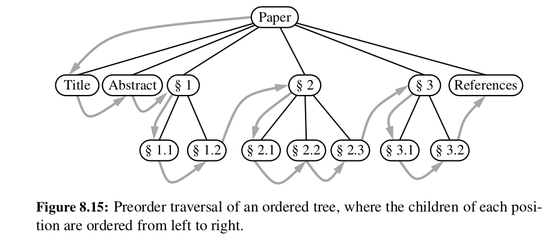
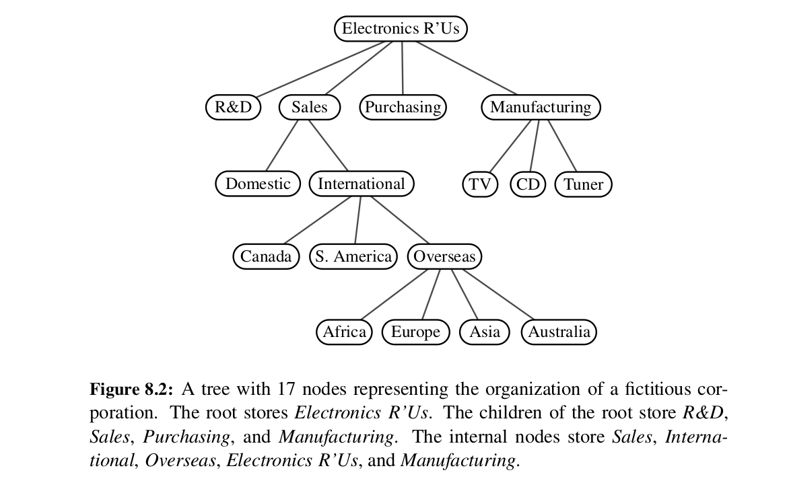
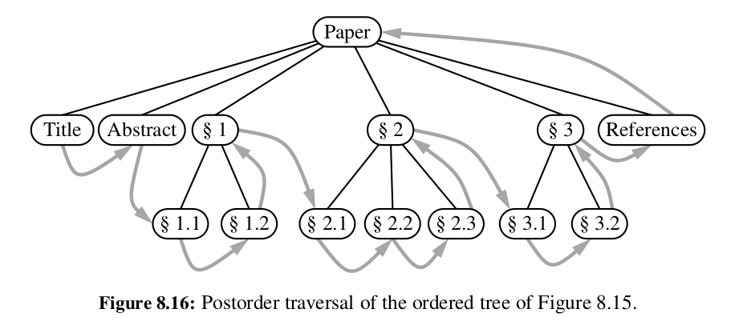
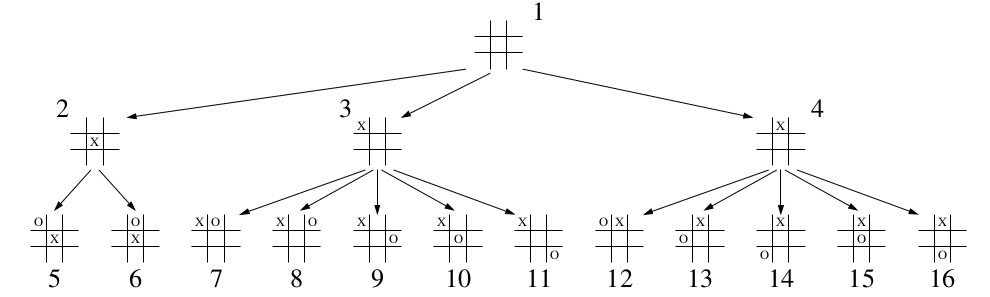

# Tree traversal algorithms

A traversal of a tree is a systematic way of accessing or "visiting" all its positions.

There are several common traversal schemes for trees, each with its own applications. These include:
- preorder traversals
- postorder traversal
- breadth-first traversal
- in-order traversal (binary tree only)

## Preorder traversal

In a preorder traversal, the current node is processed before ("pre") the traversals of its children, that's why it's called a preorder traversal.

The process can be summarized in these steps:
- process the current node
- recursively traverse and process its children 

The pseudocode would look something like this:

```
def preorder(T: Tree, p: Position):
    perform action on position p
    for child in T.children(p):
        preorder(T, child)
```

The traversal looks like this when visualized:



However, in other to implement it in our actual `LinkedBinaryTree` class, using a generator, we will need to make the code a bit more complex. Because we want to offer a public method, which does not take any arguments, therefore we will need to make a non-public helper method, which does take an argument. The implementation looks like this:

```
def preorder(self):
    if not self.is_empty():
        for p in self._subtree_preorder(self.root()):
            yield p

def _subtree_preorder(self, p: Position):
    yield p
    for c in self.children(p):
        for other in self._subtree_preorder(c):
            yield other
```

But why are we using the nested loops in our helper method? I would have thought, intuitively, that the code would look more like this:

```
def _subtree_preorder(self, p: Position):
    yield p
    for c in self.children(p):
        yield self._subtree_preorder(c)
```

There is a reason that the code is not like that.

Let's have a look at what would happen with each version of the code, if it were run on the example tree below.



Using my suggested (probably wrong) version of the code on the given tree, the following would happen:

```
_subtree_preorder(Electronics R'Us)  # initial call on root
Electronics R'Us yielded  # root yielded
yield _subtree_preorder(R&D)  # recursive call on first child of root
```

I now understand (thank you ChatGPT) where the problem is. The expression `yield self._subtree_preorder(c)` does not return/yield the nodes/elements, instead it yields a generator object, which in itself must be iterated over. We cannot directly call `yield` on a generator expression like that (well we can, but we must understand that it will yield a generator object, not the elements themselves). That's why the first solution is implemented the way it is. However, the book from which it comes is ancient. Since Ptyhon 3.3, there is a `yield from` expression, which delegates the part of the generator's operations to another generator. Using that expression, we could simplify the code to this:

```
def _subtree_preorder(self, p: Position):
    yield p
    for c in self.children(p):
        yield from self._subtree_preorder(c)
```

## Postorder traversal

In a postorder traversal, the current node is processed after ("post") the traversals of its children, that's why it's called a postorder traversal.

The process can be summarized in these steps:
- recursively traverse and process the node's children 
- process the current node

The pseudocode would look something like this:

```
def postorder(T: tree, p: Position):
    for child in T.children(p):
        postorder(child)
    perform action on position p
```

The traversal looks like this when visualized:



## Breadth-first traversal

In a breadth-first traversal, we visit all the positions at a given depth d, before we meove on to positions at depth d + 1. This is often used when playing games, where a game tree is traversed, containing all the possible choices of moves that can be made. 

The breadth-first traversal is not recursive. Instead it uses a queue. First, we initialize a queue and put the root of the tree in it. Then, we do a loop, during which we dequeue, perform the action on the dequeued node, and then enqueue its children. The pseudocode:

```
def breadth_first(T):
    Initialize queue Q to contain T.root()
    while Q is not empty:
        p = Q.dequeue()
        perform the "visit" action for position p
        for each child c in T.children(p):
            Q.enqueue(c)
```

The traversal is easy to visualize, since we can just number the nodes level by level, left to right:



## Inorder traversal of a binary tree

During an inorder traversal, a position is visited between the recursive traversals of its left and right subtrees. A position p is visited after all the positions in its left subtree are visited, and before any positions in its right subtree are visited. 

Informally, this can be viewed as visiting the tree 'from left to right'. The pseudocode:

```
def inorder(p):
    if p has a left child lc then:
        inorder(lc)
    perform the "visit" action for position p
    if p has a right child rc then:
        inorder(rc)
```


