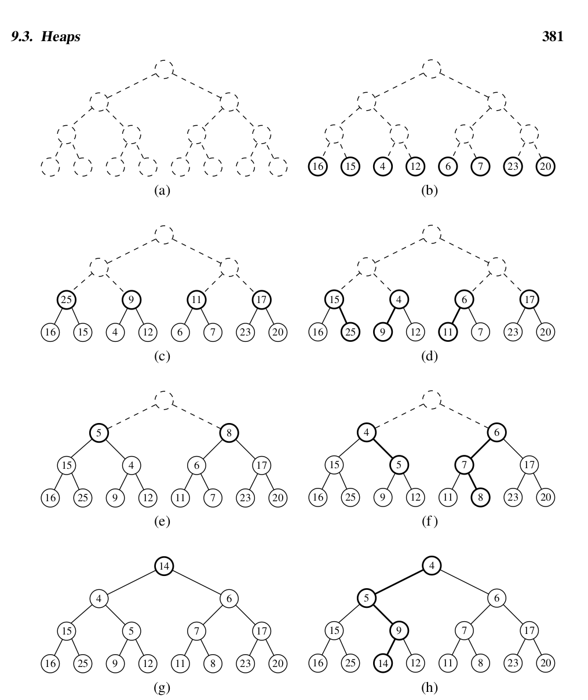
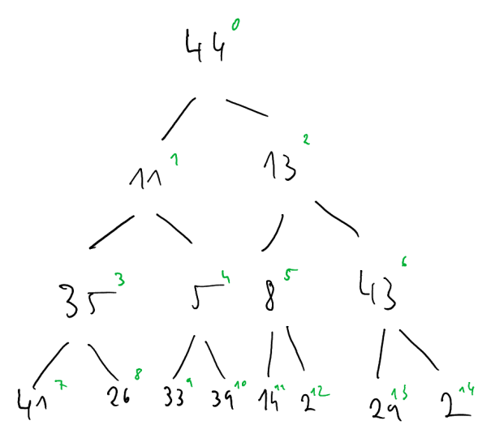
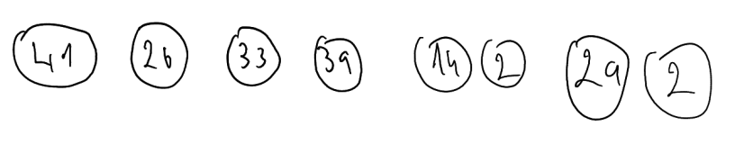
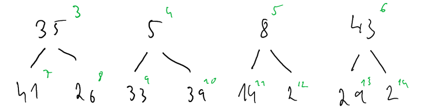
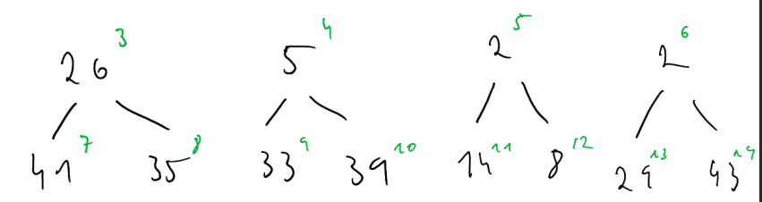
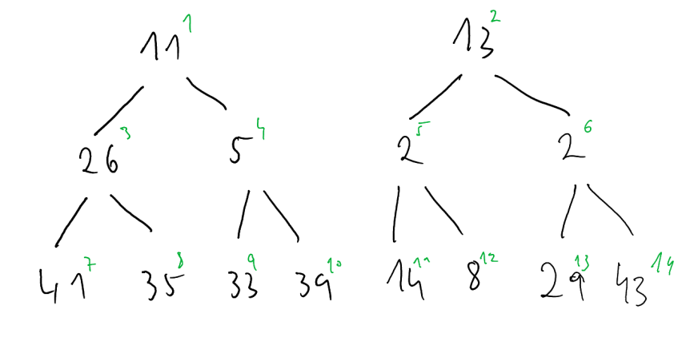
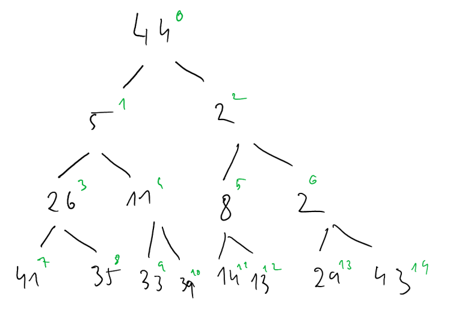
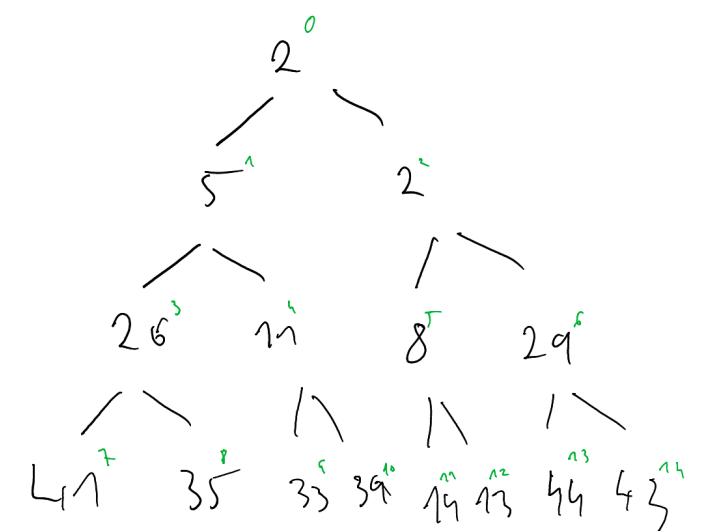
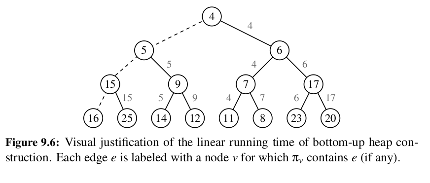
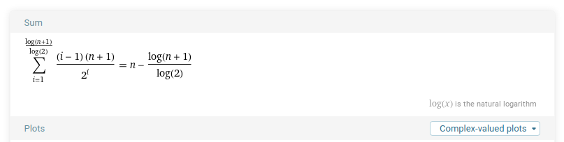

# Bottom-up heap construction of an array-based heap


## Bottom up vs top-down 

If we know the elements from which we want to construct a heap in advance, then we can use bottom-up heap construction to construct a heap with `O(n)` complexity. This is an improvement to the naive way to construct a heap. That would be to succesively keep adding elements to the heap, one by one. This is also know as the top-down approach.

The `add` operation for a heap-based priority queue has complexity `O(log(n))`. The element is added into the last possible position, and then bubbled up using the `upheap` operation. From the bottom level, it can undergo at most h swaps, where h is the height of the heap. The height is equal to log(n), where n is the total number of elements in the heap. 

Therefore, when adding n elements to the heap, where each addition has `log(n)` complexity, the total complexity is `O(nlog(n))`. Bottom-up heap construction allows us to do better than that, at O(n) complexity.


## Bottom up illustration

In bottom up heap construction, we start of with single-node 'heaps', which are the nodes initially occupying the bottom level. We then pair up these heaps and add one more element to each pair, to merge them into three-node heaps, and run a downheap operation on the newly added node, so that the heap-order property is not violated. We then repeat, to create seven-node heaps, and so on, until we finally have a single heap:



## Python implementation 

The implementation of bottom-up heap construction in Python is actually surprisingly simple. Look:

```
def __init__(self, contents: Optional[list[tuple[int, Any]]] = None):
        contents = contents or []
        self._data = [Item(k, v) for k, v in contents]
        if len(self._data) > 1:
            self._heapify()
    
def _heapify(self):
    start = self._parent(len(self)-1)
    for j in range(start, -1, -1):
        self._downheap(j)
```

Now let's explain how this extremely simple code implements the complex illustration above. Let's use the following list as an example: `[44, 11, 13, 35, 5, 8, 43, 41, 26, 33, 39, 14, 2, 29, 2]`. As a binary tree, it would currently look like this:



when using the standard numbering for a binary tree. Ie we label the root as index 0, and then left children have the index of (2 * parent_index) + 1 and right children have the index of (2 * parent_index) + 2. We consider the bottom level to be 8 single-node heaps. Since single-node heaps are by definition in order, there is no need to do any work.



In order to merge them into three-node heaps, we just need to call a `downheap` operation on the second level nodes, at indices 3 to 6. 

Before calling `downheap` on indices 3 to 6:




After calling `downheap` on indices 3 to 6:



Now, in order to merge these three-node heaps into 7-node heaps, we just call `downheap` on indices 1-2. The current list representation of the heap is `[44, 11, 13, 26, 5, 2, 2, 41, 35, 33, 39, 14, 8, 29, 43]`. The current node representation, before calling `downheap` is:




After calling `downheap` on 1-2:



And finally, in order to merge the two 7-node heaps into a single 15-node heap, we just call downheap on index 0:



## Justification of O(n) running time

### Inorder successor paths justification

Let's consider π<sub>v</sub>, which is the parth from a (non-leaf) node v to its 'inorder successor'. The 'inorder successor' is the node which would come after v during an inorder traversal of the binary tree. To get to the inorder successor, we first go to the right child of v, and then keep going left, until we reach a leaf node. While this is not neccesarily the path taken during down-heap bubbling of v, it does provide an upper bound on the complexity of the down-heap operation at v. Therefore, the total running time of the bottom-up heap construction algorithm can be bound by the sum of the sizes of these paths.



The key claim is that the paths π<sub>v</sub> are edge-disjoint. Meaning that an edge only ever appears in one single path. Therefore, the sum of the path lengths is bounded by the total number of edges in the tree, and thus is O(n). The argument for the paths being disjoint is as follows. For right leaning edges it's obvious, since each path only contains one sigle right leaning edge, going from a particular node to its right child (and no two nodes can possibly share a right child). For left leaning edges, we must consider first, that left leaning edges are always part of a consecutive group, until a node is reached. Second, from any of the applicable nodes, if we keep going left, we only ever reach one particular leaf node. Since each non-leaf node must have a different inorder successor, no two such paths can contain the same left-leaning edge. Thus, we can conclude that bottom-up construction of a heap T takes O(n) time.


### Sum justification


An alternative proof is to try to actually count the number of steps involved. If we look back at the image illustrating bottom-up heap construction, we can describe the steps as follows:

1. In the first step, we construct (n+1)/2 heaps, each containing one entry. Since single-node heaps by definition must obey the heap-order property, no more work is done in this step.
2. In the second step, we form (n+1)/4 heaps, each storing three entries. And for each heap, we could at most possibly do one swap, in order to restore the heap order property.
3. In the third step, we form (n+1)/8 heaps, each storing seven entries. And for each heap, we could at most possibly do two swaps, in order to restore the heap order property.

At this point, we can discern the pattern. At the ith step, at most (i-1) * (n+1)/2^i swaps can be made. The total number of steps taken is log(n+1). Therefore, the number of swaps done is the sum from 1 up to log(n+1) of (i-1) * (n+1) / 2^i. Using wolfram alpha, this sum turns out to be n - (log(n+1)/log(2)). Hence O(n).

