# Exercises

## 9.1

Each remove_min operation takes log(n) time, so removing the log(n) smallest elements would take log(n) * log(n) = (log(n))^2 time.

## 9.2

In a preorder traversal, children are always visited after their parents, so the ranks (and therefore also keys) of children would always be greater than those of parents. Therefore, the heap order property would always be satisified. So in order for the binary tree to be a heap, it would also have to satisfy the complete binary tree property.

## 9.3

1, D

3, J
4, B

5, A

2, H
6, L

## 9.4

A priority queue implemented using a heap. A priority queue is well-suited, because we want to remove items with the lowest priority, and add items with arbitrary priority (ie not necessarily to the end). And a heap implementation offers the best possible running times for these two operations, with logarithmic time for both adding and removing the minimum item. 

## 9.5

Done in separate file.

## 9.6

Not possible.

## 9.7

Illustrate the execution of the selection-sort algorithm on the following
input sequence: (22,15,36,44,10,3,9,13,29,25)

On each pass, iterate over all items in front of the current index, in order to find the minimum item. Then swap the minimum item with the current index. Then increment index.

index = 0

22,15,36,44,10,3,9,13,29,25
__             _

index = 1

3,15,36,44,10,22,9,13,29,25
  __             _

index = 2

3,9,36,44,10,22,15,13,29,25
    __    __

index = 3

3,9,10,44,36,22,15,13,29,25
       __          __

index = 4

3,9,10,13,36,22,15,44,29,25
          __    __

index = 5

3,9,10,13,15,22,36,44,29,25
             __

index = 6

3,9,10,13,15,22,36,44,29,25
                __       __

index = 7

3,9,10,13,15,22,25,44,29,36
                   __ __

index = 8

3,9,10,13,15,22,25,29,44,36
                      __ __

final

3,9,10,13,15,22,25,29,36,44

## 9.7

Illustrate the execution of the insertion-sort algorithm on the following
input sequence: (22,15,36,44,10,3,9,13,29,25).

During insertion sort, we start at the second item of the array, and maintain that the sequence to the left of the current item is in sorted order. We then insert the currently iterated item into the proper position of the already sorted sequence. This is done by doing neighbor-swaps until we reach an item that is less than the currently swapped item. Compared to selection sort, the advantage is that we do no work for items which are already in the correct order (ie they are greater than the greatest item of the already sorted part of the sequence)

index = 1

22,15,36,44,10,3,9,13,29,25
   __

index = 2

15,22,36,44,10,3,9,13,29,25
      __

index = 3

15,22,36,44,10,3,9,13,29,25
         __

index = 4

15,22,36,44,10,3,9,13,29,25
            __

index = 5

10,15,22,36,44,3,9,13,29,25
               _

index = 6

3,10,15,22,36,44,9,13,29,25
                 _

index = 7

3,9,10,15,22,36,44,13,29,25
                   __

index = 8

3,9,10,13,15,22,36,44,29,25
                      __

index = 9

3,9,10,13,15,22,29,36,44,25
                         __

final

3,9,10,13,15,22,25,29,36,44

## 9.9 

Give an example of a worst-case sequence with n elements for insertion-sort, and show that insertion-sort runs in Ω(n2) time on such a sequence.

The worst case sequence for insertion-sort is a sequence sorted in the opposite order, such as 6,5,4,3,2,1. In this case, each element has to be inserted at the beginning. Meaning that the element at index i has to undergo i swaps. The total number of swaps will therefore be 1 + 2 + 3 + ... + i-2 + i-1, ie the sum of the first n integers, which is equal to n(n+1)/2. 

## 9.10

If we consider a heap which only stores distinct keys (so that there is only a single third largest key), then the possible positions are:

- either child of the root = positions 1 and 2
- any node on the third level = positions 3, 4, 5, 6

The third smallest key cannot be anywhere else. This is because in order to maintain the heap order propertyl children must be greater than parents. Therefore, elements on the third level (when we count the root as the first level) must be greater than at least two elements (their ancestors). However, the third smallest node could also be on the second level, in cases where the root, and the other child of the root are both smaller than the child of the root.

## 9.11

The largest key must be stored either at the last level, or the penultimate level. This is because the largest key of the heap must be a leaf node, otherwise the heap order property would be violated. And a heap can only contain leaf nodes on the last level or the penultimate level, so as not to violate the complete binary tree property.

## 9.13

Illustrate the execution of the in-place heap-sort algorithm on the following input sequence: 2,5,16,4,10,23,39,18,26,15

In the first phase of the algorithm, we want to transform the given list into a maximum oriented heap. We start at the first element of the list, and move the boundary | between the heap and the remaining sequence one step at a time.

Step 1

In the first step, we therefore have a one-element heap, storing the number 2, and we want to add the number 5 to this heap:

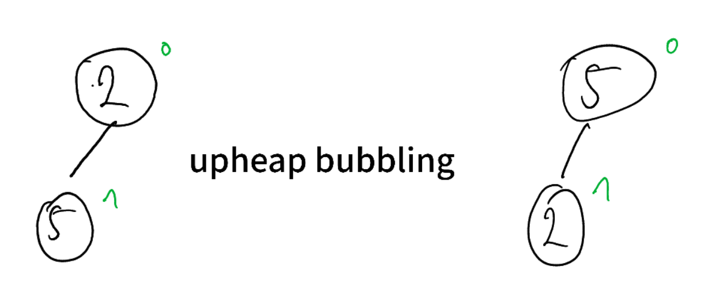

5,2|16,4,10,23,39,18,26,15

Step 2

We have a two-element heap, storing 5 and 2, and we want to add the number 16 to this heap:

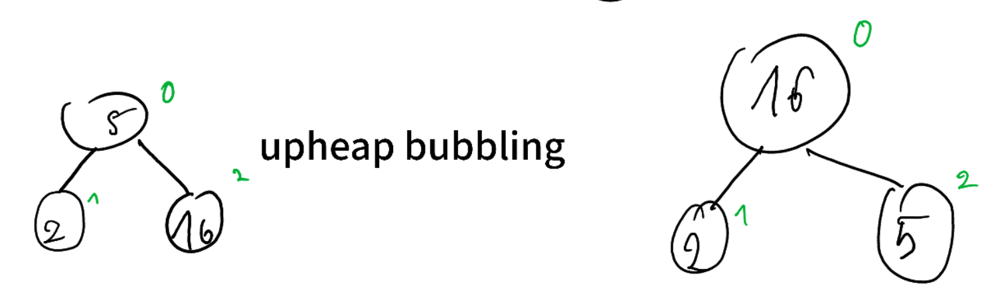

16,2,5|4,10,23,39,18,26,15

Step 3

We have a three-element heap, and add 4 to the heap:

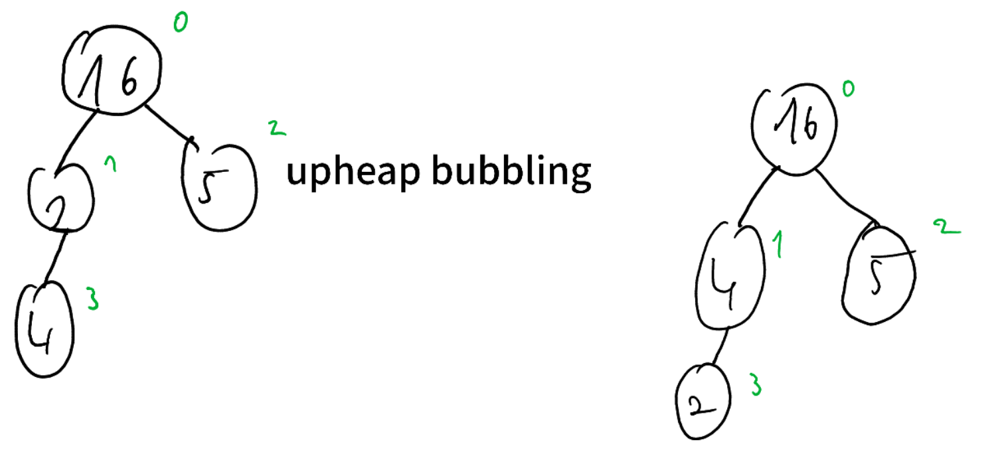

16,4,5,2|10,23,39,18,26,15

Step 4 

We have a four-element heap, and add 10 to the heap:

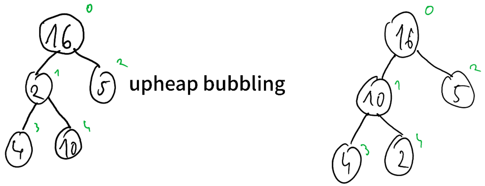

16,10,5,4,2|23,39,18,26,15

Step 5

We have a five-element heap, and add 23 to the heap:

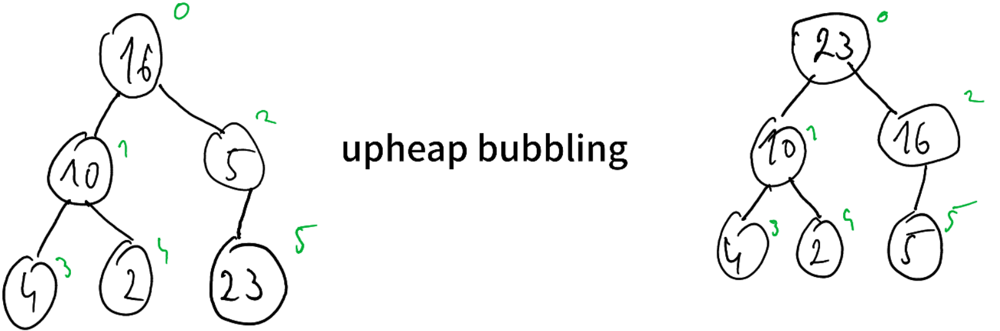

23,10,16,4,2,5|39,18,26,15

Step 6

We have a six-element heap, and add 39 to the heap:

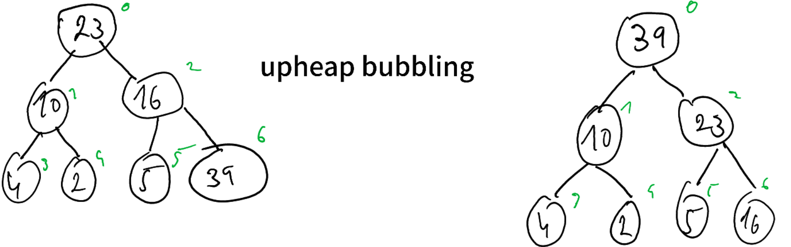

39,10,23,4,2,5,16|18,26,15

Step 7

We have a seven-element heap, and add 18 to the heap:

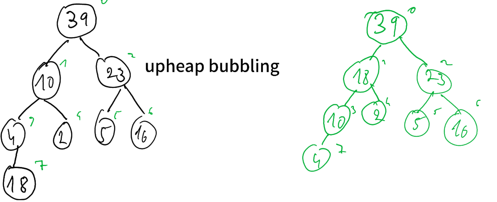

39,18,23,10,2,5,16,4|26,15

Step 8

We have an eight-element heap, and add 26 to the heap:

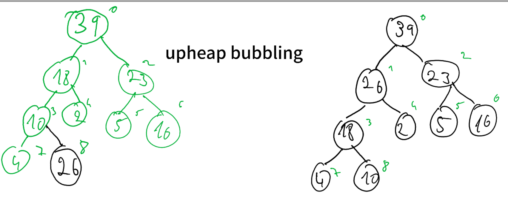

39,26,23,18,2,5,16,4,10|15

Step 9

We have a nine-element heap, and add 15 to the heap:

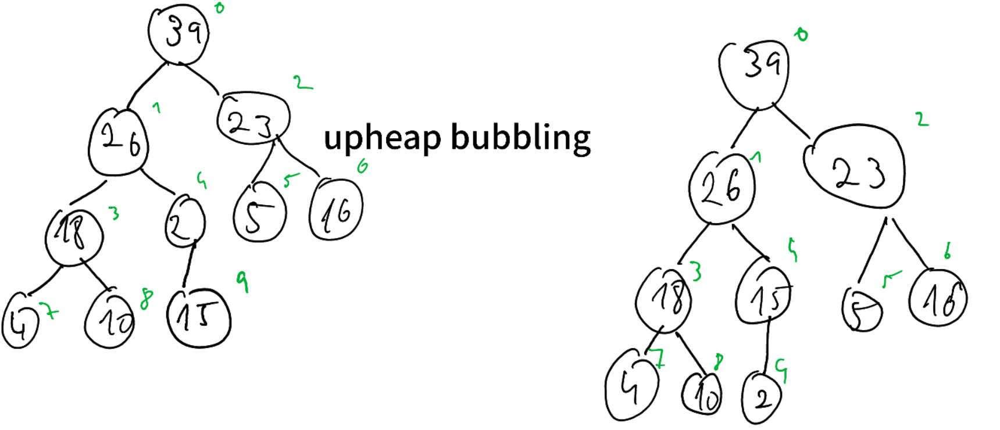

39,26,23,18,15,5,16,4,10,2

In the second phase of the algorithm, we successively call `remove_max` on the heap, and store the result at the last position of the array, which is freed up by the removal of the max element.

## 9.14

Yes, it is a heap. Level numbering makes each node in the tree have a key which is greater than its parent, so the heap order property is satisfied. And it is a complete binary tree, so that condition is satisifed as well.

## 9.15

Because in a complete binary tree it is not possible for a node to have a right child but not a left child.

## 9.16

It is possible for a preorder and postorder. For an inorder, it's impossible, since in an inorder traversal, nodes are visited in the order (left) child - parent - (right) child. Because both children are greater than the parent, an inorder traversal cannot produce keys in order.

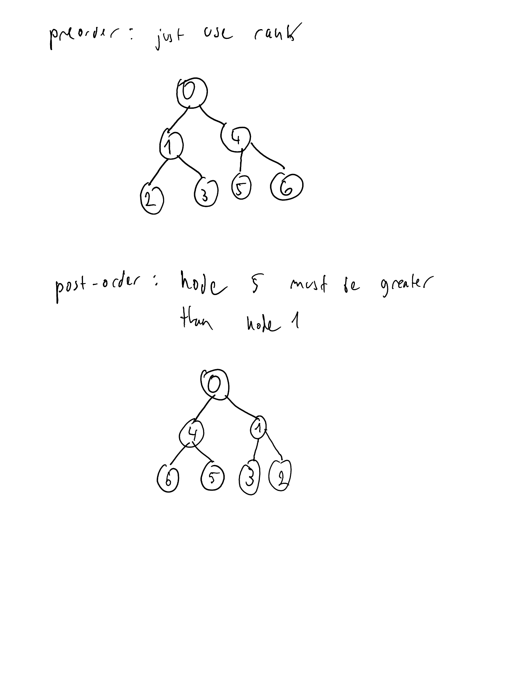

## 9.17

preorder: 0,1,3,7,8,4,9,10,2,5,11,12,6,13,14
postorder: 7,8,3,9,10,4,1,11,12,5,13,14,6,2,0
inorder: 7,3,8,1,9,4,10,0,11,5,12,2,13,6,14

## 9.18

We want to prove that the lower bound on the sum is nlog(n). Let us consider the second half of the sum. The value of the logarithms is at least log(n/2). This is equal to log(n * 1/2), which equals log(n) + log(1/2), which equals log(n) - 1. As there are n/2 of these terms in the second half of the sum, the second half is at least n/2 * (log(n) - 1). Which equals n/2 * log(n) - n/2. Which shows a lower bound of nlog(n).

## 9.19 and 9.20

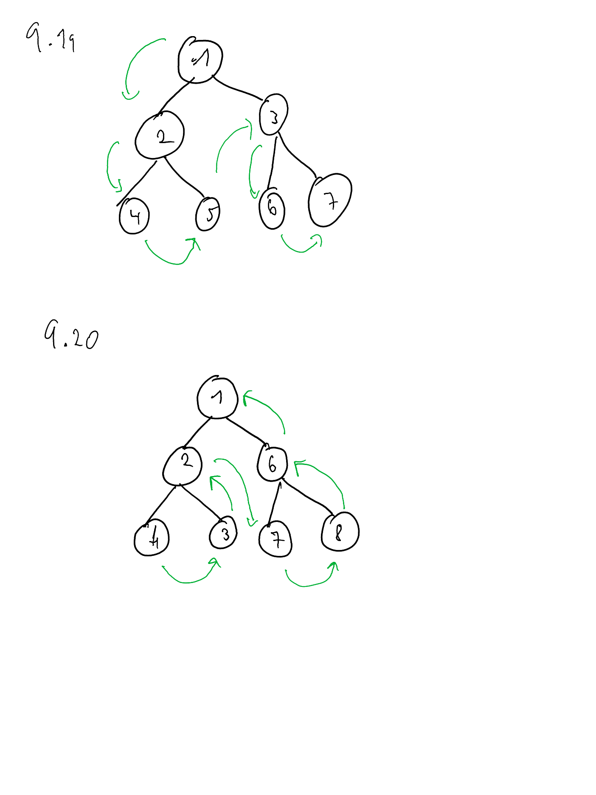

## 9.21

The heap in question:

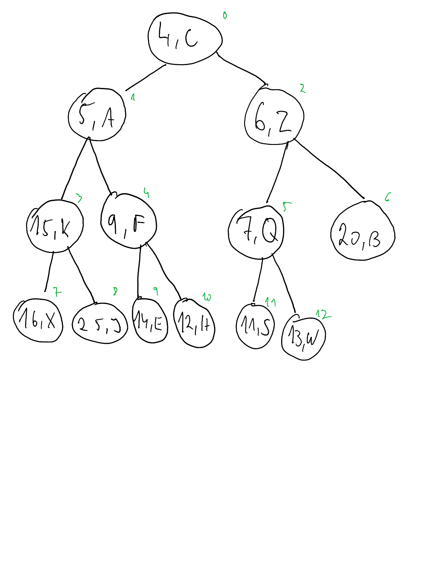

The array representation would be: 4,5,6,15,9,7,20,16,25,14,12,11,13

We wish to remove the element 16,X.

First we swap it with the last element, which is 13, W. 

Then we remove 16, X from the last position.

Then we need to bubble upheap the element 13, W. It only does one swap, with its parent 15, K.

Then we are done

## 9.22

Updating the element requires to update the key and the value, and then calling `_bubble` on it to either bubble the entry up or down, depending on the value of the new key.

## 9.23

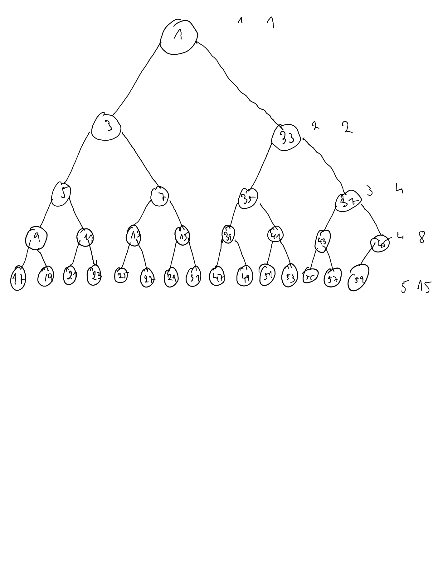

## 9.24

If we insert a new lowest value each time, then n insertions will take at least n(log(n)) time. Because inserting a new minimum requires bubbling up from the bottom level all the way to the root, which is log(n) steps.

## 9.28

No, that would not work. Let's say we add 10 elements to the queue, such that they are assigned keys 1-10 in the underlying priority queue. Then we dequeue 3 elements. At this point, we have 7 elements with keys 3-10 in the key. If we now enqueue more elements, they will get lower keys than elements already in the queue, so they would be removed before them, violating FIFO.