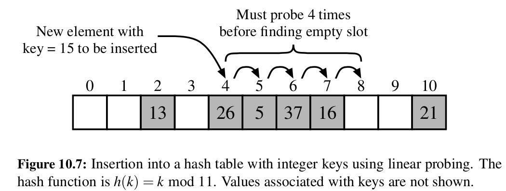

# Collision handling schemes

Because hash functions sometimes produce collisions (equal output for different inputs), we cannot simply store item (k, v) at `A[h(k)]`.

## Separate chaining

One way to deal with collisions is separate chaining. This involves creating a simple list-based table map at each index of the bucket array. 

If we store n total items in a bucket array of capacity N, then the average complexity of map operations would be O(n/N).

This ratio, n/N is also known as the **load factor** of the hash table, and it should be a small constant, preferable less than 1.

## Open addressing

The disadvantage of separate chaining is that it requires the use of an auxiliary data structure to hold items with colliding keys. 

An alternative approach is to always store each item directly in a table slot. These are called open addressing schemes, and there are several of them.

All open addressing schemes require that the load factor is always at most 1. Otherwise, if n is greater than N, we obviously cannot store all items directly in a table slot.

### Linear probing

If we try to insert an item (k, v) into a bucket A[j], where j is the result of a hashing function h(k), then we simply try to look for the next available table spot at j+1 % N, then j+2 % N, then j+3 % N, until we find an empty spot, where we then insert the element:

When trying to get an item from the hash table, we must then start at index j, and look until we find the item, or until we reach an empty spot without having found the item, which would indicate a `KeyError`.

When deleting an item from the array, however, we cannot simply delete it. Because if we just delete it, then search for an item at j, which is actually stored at j+4 due to a collision, but we delete the item at j+2 and leave it empty, then a subsequent search for the item at j would raise `KeyError`. Typically we get around this by replacing the deleted item with a special 'available' marker object. The search is then modified so that it skips over these marker objects, and goes on until either the object is found, an empty cell is reached, or we've searched the entire table without finding. 