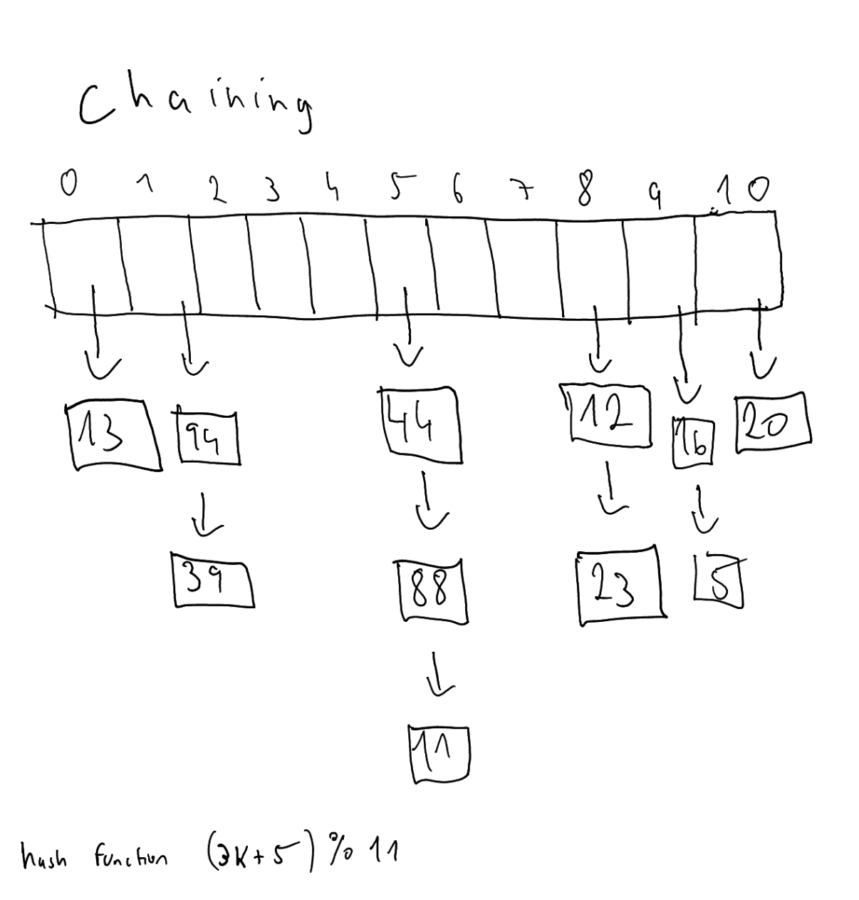
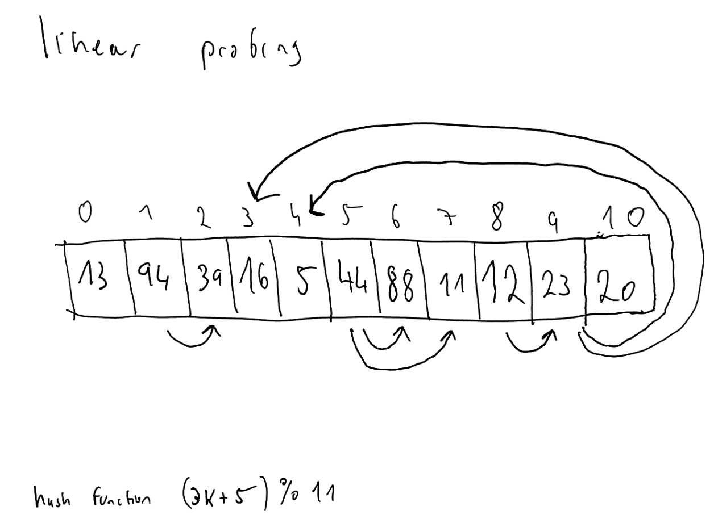
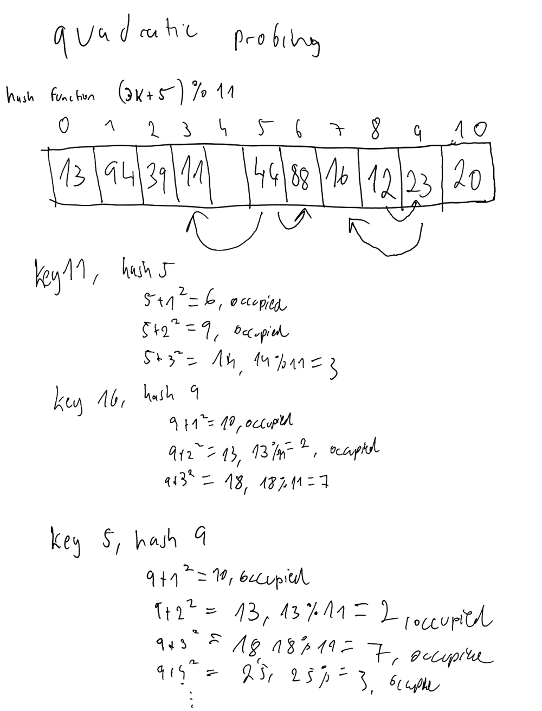
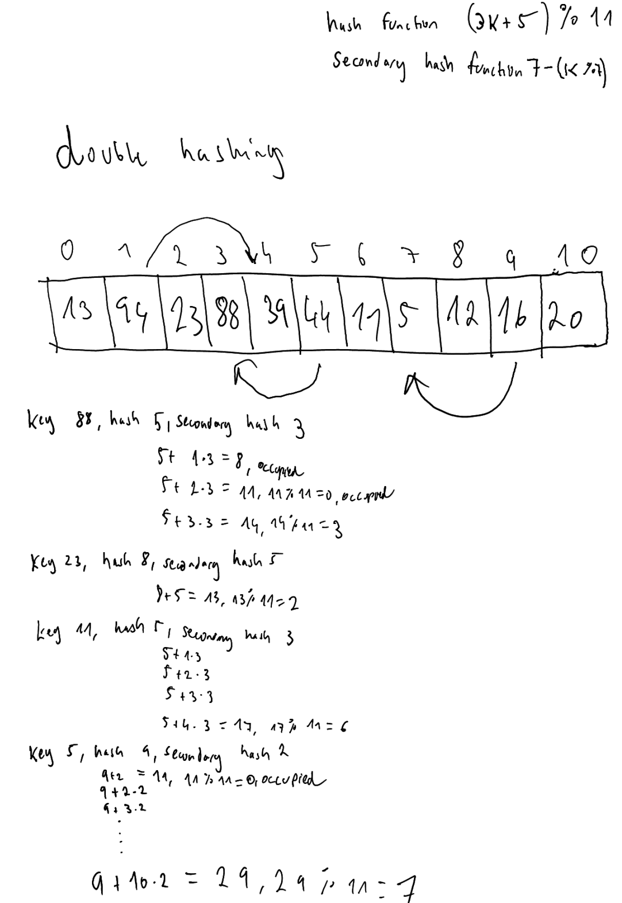
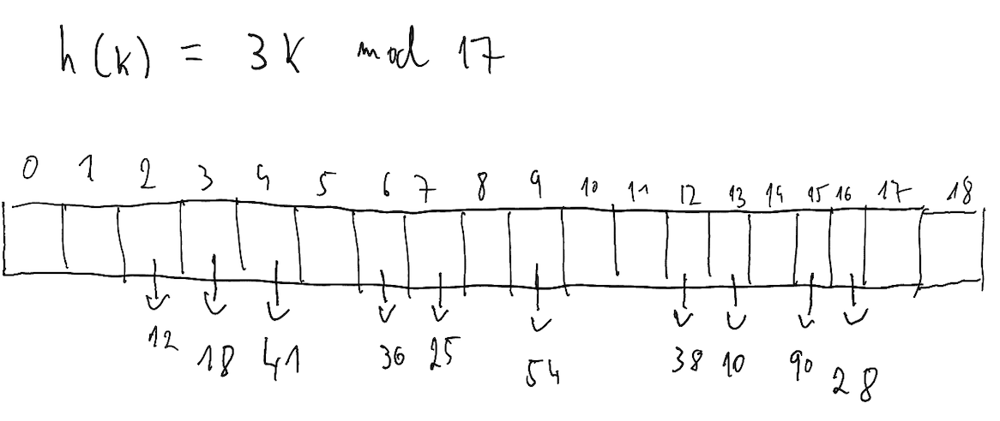
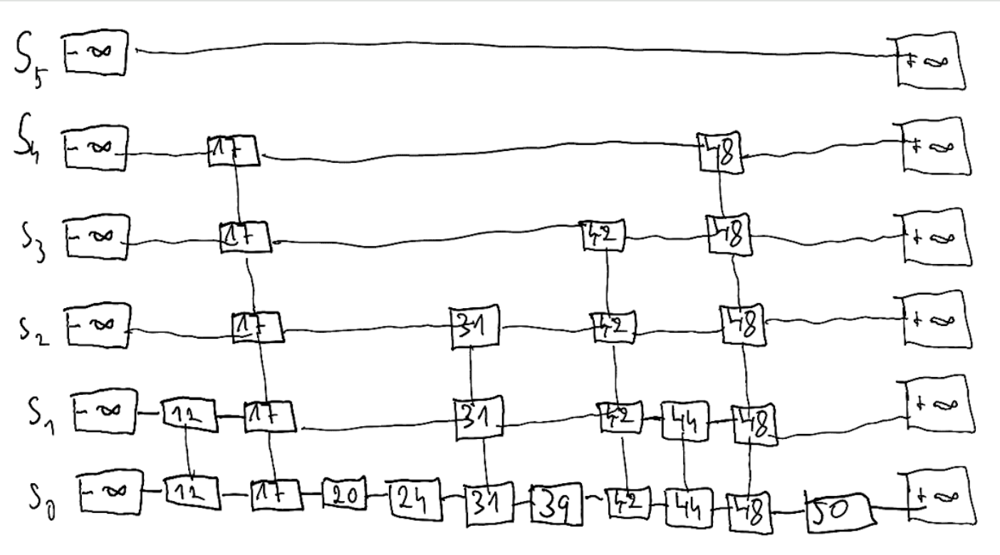

## 10.4

What is the worst-case running time for inserting n key-value pairs into an initially empty map M that is implemented with the UnsortedTableMap class?

Worst case of inserting n key-value pairs into UnsortedTableMap is O(n^2), because `__setitem__` searches the entire list each time (ie O(n)), since it has to check whether we are overwriting an existing value, or adding a new one.

## 10.6

Which of the hash table collision-handling schemes could tolerate a load factor above 1 and which could not?

Only separate chaining can deal with a load factor above 1. Other collision-handling schemes rely on there being empty slots in the bucket array into which it can store key-value pairs in case of collision.

## 10.7

Our Position classes for lists and trees support the eq method so that
two distinct position instances are considered equivalent if they refer to the same underlying node in a structure. For positions to be allowed as keys in a hash table, there must be a definition for the hash method that is consistent with this notion of equivalence. Provide such a hash method.

The hash method must be based on the node alone. So make a hash based on the node's `id()`:

```
def __hash__(self):
    return id(self._node)

```

## 10.8

What would be a good hash code for a vehicle identification number that is a string of numbers and letters of the form “9X9XX99X9XX999999,” where a “9” represents a digit and an “X” represents a letter?

Either polynomial hash code, or cyclic bit shift. Definitely not a sum or XOR based hash code, since we want order to matter.

## 10.9



## 10.10



## 10.11



## 10.12



## 10.13

What is the worst-case time for putting n entries in an initially empty hash table, with collisions resolved by chaining? What is the best case?

The worst case is that all the keys hash to the same value. Therefore, when adding the first key, there would be 0 collisions, second key would be 1 collision, third key would be 2 collisions, and so on. And all the entries which hash to the same value have to be iterated, to check whether we are adding a new key, or overwriting an existing one. This sum is esentially from 1 to n, which equals n*((n+1)/2), which is O(n^2). The best case for n insertions is O(n), since in the best case, each insertion is O(1).

## 10.14



## 10.18

Because a hash map scatters keys randomly throughout the underlying array

## 10.19

Compared to using an array-based structure for a sorted map, the main differences are that a doubly linked list does not support binary search, and insertions and deletions anywhere in the list are O(1). The array based sorted map can use binary search to find an item (or an insertion position) in log(n) time. So reads are O(log(n)), but insertion of new keys and deletion of keys requires all the items after to be shifted, which is O(n). On the other hand, a linked structure would require linear search to find the item, which is O(n). But subsequently inserting or deleting a key-value pair is O(1). So in a linked-list based sorted map, reads, writes and deletions would all be O(n) in the worst case. 

## 10.20

The worst case for performing n deletions from a SortedTableMap is O(n^2). Items can be found using log(n) steps. But deletion takes O(n-k) steps, where k is the index of the item being deleted, since all the items in front of the deleted item need to be shifted. So each deletion is O(n) worst case, therefore n of them is O(n^2) worst case.


## 10.22

What is the expected running time of the methods for maintaining a maxima set if we insert n pairs such that each pair has lower cost and performance than one before it? What is contained in the sorted map at the end of this series of operations? What if each pair had a lower cost and higher performance than the one before it?

If each pair has lower cost and performance than the one before it, then all the pairs will be added to the map, and remain in it after the series of operations, because it means that no pair dominates another pair. 

The expected running time for each `add` call would be O(log(n)) if the maxima set is implemented using a skip list, and O(n) if it is implemented using a sorted table map. That's because the item is being inserted into first position each time, so all the items in front of it need to be shifted. Therefore the total running time would be O(nlog(n)) for the skip list and O(n^2) for the sorted table map.


On the other hand, if each pair had a lower cost and higher performance than the one before it, then the map would always remain at size 1, since the newly added pair would remove the one existing pair. Therefore, for both a skip list and a sorted table map, the complexity would be O(n).

## 10.23



The height of the 'towers' of the newly inserted items, 24 and 48, depends on the number of 'consecutive coin tosses which come up heads'.


## 10.24

Give a pseudo-code description of the delitem map operation when
using a skip list

```
p = skip_search(k)
if not p:
    raise KeyError
while above(p) is not None:
    unlink left and right neighbours
    p = above(p)
decrement n
```

## 10.27

What abstraction would you use to manage a database of friends’ birthdays in order to support efficient queries such as “find all friends whose birthday is today” and “find the friend who will be the next to celebrate a birthday”?

A sorted map, ideally implemented using a skip list.

## 10.31

The sieve of Erastothenes algorithm works by marking multiples of numbers as non-prime, leaving us with only prime numbers. For example, if we wanted to look for all prime numbers up to 100. We would initially set p to 2, and then mark all multiples of p in the range p^2 up to 100. We then increment p to 3, check that it has not been crossed off, and again mark all multiples of 3 in the range of 9 (p^2) to 100. We then increment to 4, but it has been crossed off already, so we continue to 5, then skip 6, go to 7, and so on. Note that we always start at p^2, because smaller multiples of p would have been marked previously. For example, when looking at mulitples of 3, we start with 9. But 6 would have already been marked when going over multiples of 2.

Now, let's look at an example to see how the bootstrapping step, in which we first find the primes up to sqrt(2M) helps. Let M = 100, such that we are looking for primes in the range 100 to 200. 

### Wihtout bootstrapping

- generate a boolean array of length 200
- mark all multiples of 2 in range 4, 200
- mark all multiples of 3 in range 9, 200
- mark all multiples of 5 in range 25, 200
- mark all multiples of 7 in range 49, 200
- mark all multiples of 11 in range 121, 200
- mark all multiples of 13 in range 169, 200 

### With bootstrapping

Bootstrapping

- generate boolean array of size 14 (square root of 200, rounded)
- mark all multiples of 2 in range 4, 14
- mark all multiples of 3 in range 9, 14
- At this point, all non-primes have been marked in the range, return list of primes [2, 3, 5, 7, 11, 13]

Generation

- generate boolean array of length 200
- mark all multiples of 2 in range 100, 200
- mark all multiples of 3 in range 102, 200
- mark all multiples of 5 in range 100, 200
- mark all multiples of 7 in range 105, 200
- mark all multiples of 11 in range 121, 200
- mark all mutliples of 13 in range 169, 200

So for numbers where p^2 is much smaller than the beginning of the range, we saved a bunch of iterations. For example for 2, rather than marking all multiples of 2 in the range 4 to 200, we marked just in the range 100 to 200