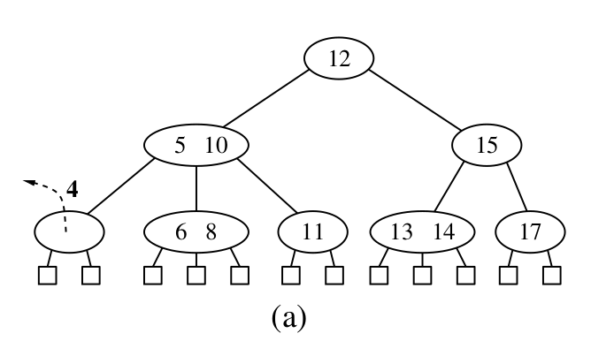
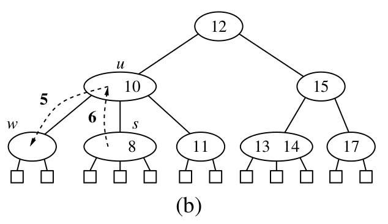
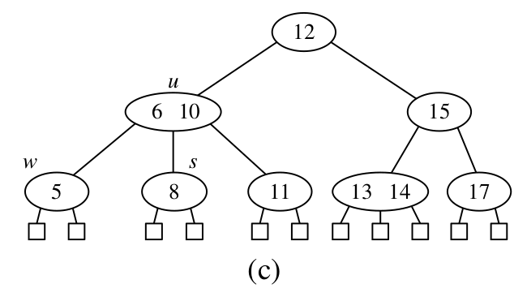
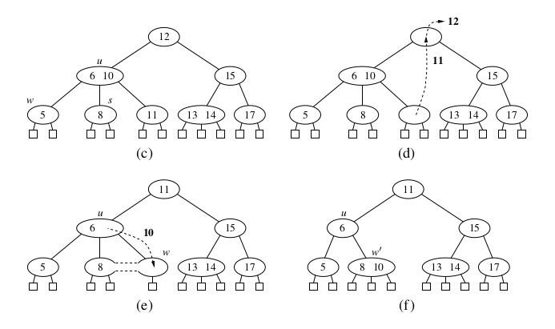
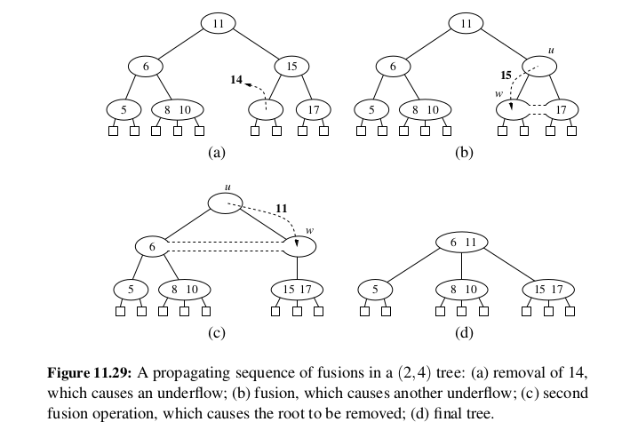

# (2, 4) trees

A 2, 4 tree is a specific type of multiway search tree. It maintains the following two properties at all times:

1. Size property: every internal node has at most four children (and three values).
2. Depth property: All the external nodes have the same depth.

From these properties, it follows that he number of nodes for a 2, 4 tree with height h is:

`2^h <= n + 1 <= 4^h`

The height of the tree is therefore logarithmic. All operations run have O(log(n)) complexity in the worst case.

## Representation

The tree is typically represented as a general linked tree, in which each node contains either 1, 2 or 3 key-value pairs, and 2, 3, or 4 references to child nodes. We also typically represent the bottom of the tree (the external nodes) as empty nodes.  

# Updating a (2, 4) tree 

## Insertion

To an insert a new item (k, v) into this tree, we first perform a search, looking for k. Assuming that k is not actually found in the tree, the search will terminate at an empty, external node z. We will then simply insert the element into its key parent, w. This way we will definitely preserve the depth property of the tree. However, we may violate the size property. If we insert a new element into a 4 node, it will become a 5-node, which violates the size property. This is called an overflow. In this case, we perform a split operation. Let's label the four keys of the overflowing 5-node as k1, k2, k3, k4. Key k3 gets promoted to the parent node. Keys k1 and k2 then split to form their own node, and key k4 also becomes its own node:

And here is an example of a sequence of insertions:

As you can see, and as was perhaps obvious from the description of an insertion, the height of a 2, 4 tree never actually increases due to nodes being inserted at a greater depth. Instead, an overflow can cascade to the top of the tree. So a 2, 4 tree can only grow from the top, unlike let's say a normal binary tree, which grows by adding to the bottom.

## Deletion

Deleting an item in a 2, 4 tree can always be reduced to the case of removing the item from an external node (or a node whose children are all external nodes, if we use that representation of the tree). 

If we are removing an item which is found in an internal node, then we proceed similarly as in a deletion from a binary tree node with two children. In that case, we swap the node with the rightmost node in the left subtree, and then we delete. Similarly, in a 2, 4 tree, we swap the item with the rightmost item in the 'left' subtree. 

By deleting as described above, we preserve the depth property. But again, we may violate the size property, if we delete an item from a 2-node (with a single item and two children). This is called an underflow. Let's denote the node from which we are deleting the item as w, its sibling as s, and their common parent as u. We deal with an underflow in one of two ways, depending on the size of the node's sibling nodes:

1. The node has a 3-node or 4-node as an immediate sibling

In this case, we perform a transfer operation. During a transfer operation, we move a key from the sibling s to the common parent w, and we move another key from the parent w to u, so that it does not become a 1 node. We also move a child from s to w. 

2. The node does not have a 3-node or 4-node as an immdediate sibling

In this case, we perform a fusion operation. During a fusion operation, we move a key from the parent node w to the node u. And then we merge u with its sibling s. 

Because we are removing a key from the parent during a fusion operation, we may cause a cascading effect of underflows. If it propagates all the way up to the root, then the root is simply deleted:

