# AVL tree

An AVL tree is a binary search tree which satisfies the height-balance property. Meaning that every position p in the tree has children whose heights differ by at most 1.


## Updating an AVL tree

The challenge is how to update an AVL tree (adding and removing nodes) and still maintain its height-balance property

### Insertion

After insertion, any imbalances that occur can be fixed using a trinode restructuring. But first we need to find the nodes to restructure. In particular, we go up the tree, from the inserted position, until we find the first node with an imbalance, meaning the first node whose children have a difference in height of 2. Note that it must be 2, it cannot be less, since that would not be an imbalance. And it cannot be greater, because then the tree would have already been imbalanced before the insertion. We then designate its child with the greater height as y. This must be the node whose height, before the insertion, was one greater than that of its sibling. And finally, we designate x, again as the child with greater height (though this time it's the child of y). Note that y and z must be ancestor of the newly inserted position p. And x must be either an ancestor, or the newly inserted node itself.

Here's a concrete example of a tree imbalance occuring after an insertion, with x, y and z identified:

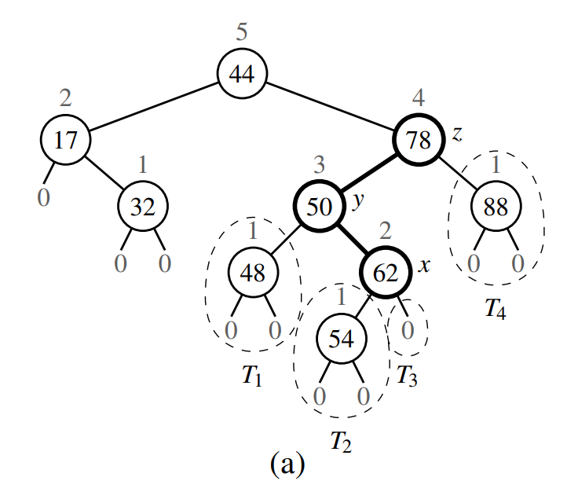

And here's a more general/abstract view, of a tree before the insertion:

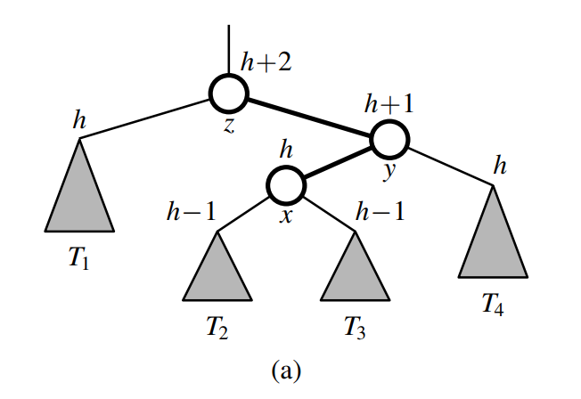

And after the insertion:

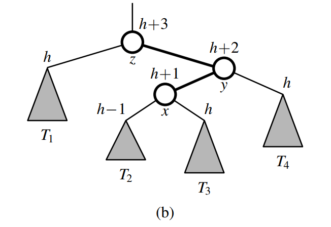

We then do a trinode restructuring, involving two rotations of x:

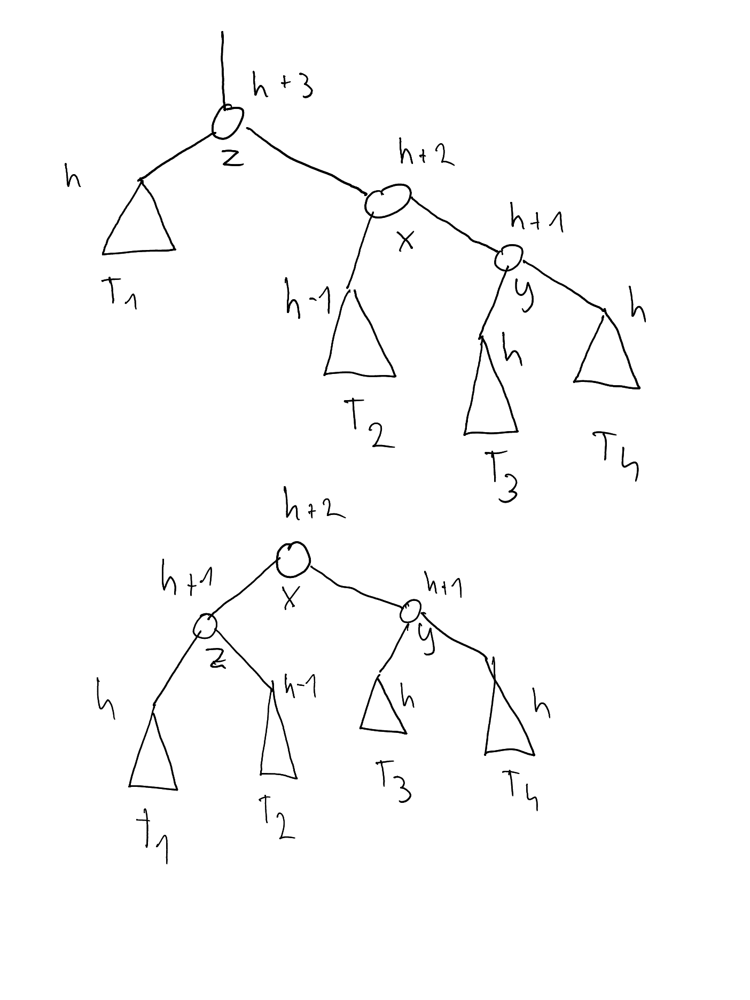

---

#### Determining heights after rotations

One must be careful when determining the change in heights during a rotation, because it might be a little unintuitive. During a rotation, only the heights of the two swapped nodes can change. The heights of all the other nodes and subtrees are unaffected. By how much they change depends on the particular situation, it is not necessarily always the case that one of the nodes increases by one and the other one decreases by one. To determine the change in heights, its best that we start from the bottom up. For example, if we consider the second rotation in the image above. Before the rotation, z had height `h+3` and x had height `h+2`. The reason that z had height `h+3`, is that it had x as its greater child, and the height of a node is by definition 1 greater than the height of its greater child. After the swap between the two occurs, z has as its children T1 and T2, whose heights are `h` and `h-1`. Their heights could not have been changed by the swaps, because nothing was inserted or otherwise changed in the subtrees rooted at T1 and T2. Therefore, the height of z after the swap must be `h+1`, ie 1 greater than the height of its greater child T1. Now that we know the height 

---

As we can see from the heights of all nodes, the tree is balanced after a single trinode restructuring. And because the height of the root of the subtree (originally z, after the restructuring x) also remains the same at `h+2`, it means that the balance property is also restored globally. Meaning that we could not have caused an imbalance between what was originally z's sibling and this subtree.

### Deletion

Just like for insertion, an imbalance can occur in a binary search tree after a node is deleted. The deletion of a node can decrease its height by one. Again, we deal with the resulting imbalance using a trinode restructuring, but the process is a bit more complex compared to insertion. To identify our three position for restructuring - x, y and z - the first step is the same. We designate as z the first node which has become unbalanced when we walk up the tree from the paren of the deleted position. Node y is then the taller child of z, ie the child of z which is not an ancestor of the deleted node p. Node x is then either the taller child of y, if one exists. Otherwise, in case that the children have the same height, then x is the same side child as y is to z. 

Once we've identfified the three nodes, we do a trinode restructuring. However, we may not be finished. While after an insertion, a single trinode restructuring restores balance locally as well as globally, this is not necessarily the case after deleting. After deleting, while we will have restored balance locally, we won't necessarily have restored balance globally. This is because the height of the subtree can change by one, which could cause imbalances further up the tree. Whether the height of the subtree changes depends on whether the children of y have equal height or not. Let's look at the 3 possible cases during a deletion:

1. The children of y have equal height, therefore x must be on the same side as y
2. The children of y have different heights. Therefore, x must be the child with the greater height. Here, we consider the case where x is on the same side as y
3. The children of y have different heights, but x is on the opposite side compared to y

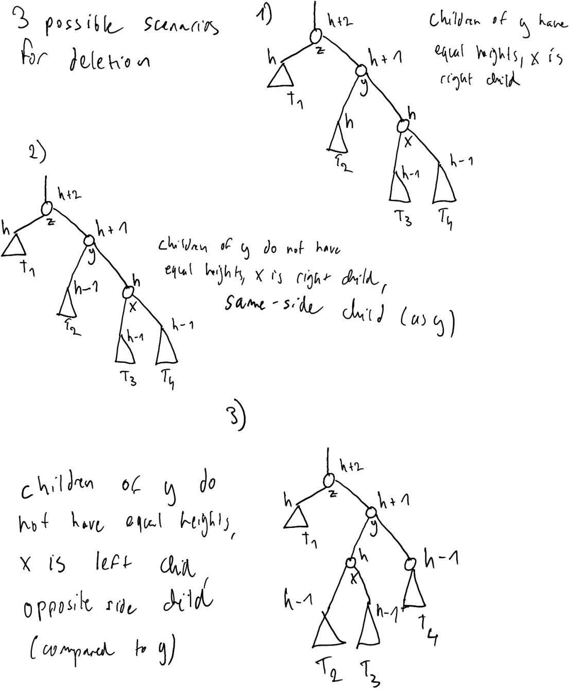

If we look at the scenario where the children of y have equal heights, we get the following:

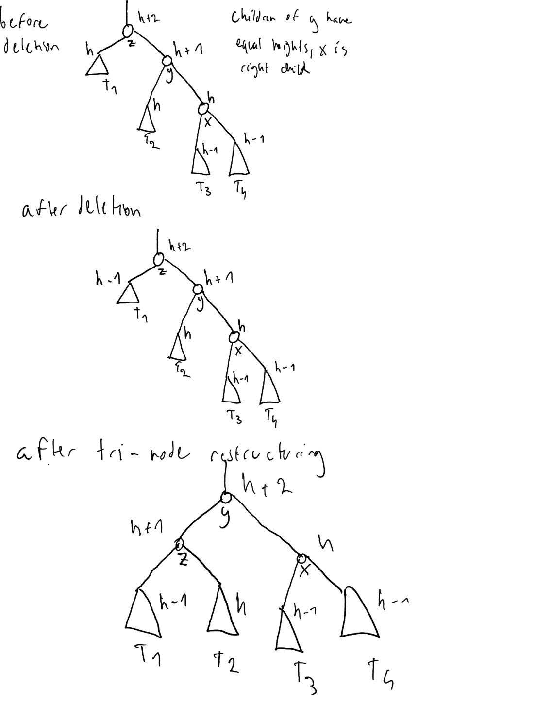

We can see that the root of the subtree has height `h + 2` both before and after the restructuring. Therefore, no further imbalances could have been caused further up the tree.

Now, let's consider the scenarios where the children of y have different heights, ie the height of x is greater than the height of its sibling, by one. First, we will look at a case where x is on the same side as y:

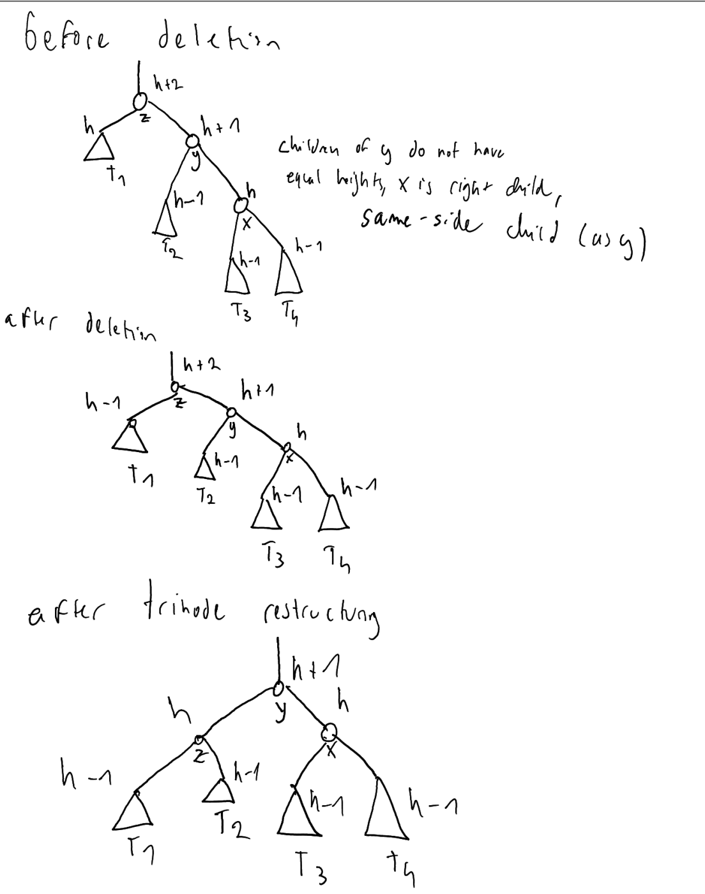

As we can see, the overall height of the subtree has decrease by one, going from `h + 2` before the deletion/resturcturing, to `h + 1` after the restructuring. This could therefore introduce further imbalances up the tree, if previously the sibling of this subtree had height that was one greater - it would now be greater by two.


And finally, the case where the x has greater height, and is on the opposite side of y:

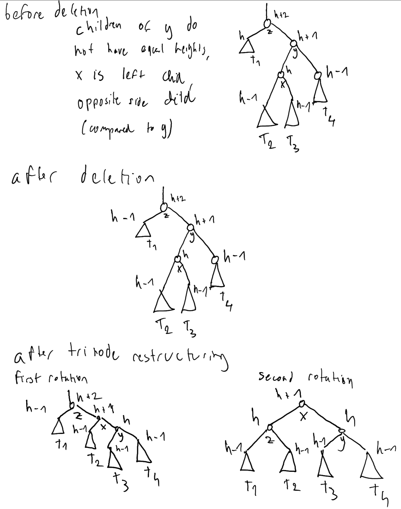

As we can see, the result is the same in terms of the decrease in the overall height of the whole subtree. 

In conclusion, if the children of y are of equal height, then one trinode restructuring is sufficient after a deletion. On the other hand, if the children of y have different heights, then further restructurings might be necessary.

## Implementation

In the book code, both `_rebalance_insert()` and `_rebalance_delete()` are implemented by just calling the same `_rebalance()` helper method:

```
  def _rebalance(self, p):
    while p is not None:
      old_height = p._node._height # trivially 0 if new node
      if not self._isbalanced(p): # imbalance detected!
        # perform trinode restructuring, setting p to resulting root,
        # and recompute new local heights after the restructuring

        p = self._restructure(self._tall_grandchild(p))
        self._recompute_height(self.left(p))                
        self._recompute_height(self.right(p))                           
      
      self._recompute_height(p)  # adjust for recent changes
      if p._node._height == old_height:  # has height changed?
        p = None  # no further changes needed
      else:
        p = self.parent(p)  # repeat with parent

```

Let's look at an example deletion and insertion.

### Deletion

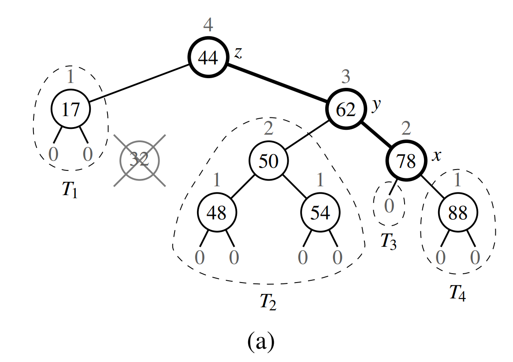

The node containing the value 32 has been deleted in this example. It was orignally the right child of the 17 node, and it was a leaf node itself, so the deletion is simple. The position representing the 17 node is then passed to the `_rebalance()` method.

The old height of the 17 node is still 2, because it used to have 32 as its child, and the height has not been recomputed since. Although still using old heights, the node would not be considered imbalanced. The height is then recomputed, so it would now be 1. And we then move on to the parent, the root. Because we have now adjusted the height of the 17 node, the root would be considered imbalanced. Its tall grand child would be the 78 node, because the children of the y node have equal height, so the right node would be preferred, as y is also a right child. As x, y and z are in alignment, the trinode restructuring, performed by `_restructure`, can be done in a single rotation of the y and z nodes. `_restructure` then returns the new root of the subtree, which is node y. We then recompute the heights of its left and right children, nodes z and x respectively. Finally, we recompute the height of y. At this point, all the necessary height recalculation are done, since we have recomputed the heights of all three nodes involved in the restructuring. Finally, when we check `if p._node._height == old_height`, this will be True. The height has not changed. But notice that old_height was computed based on node z, whereas at this point, `p` represents node y. This is the comparison we want to make though, we want to compare the height of the original root of the subtree to the height of the current root of the subtree. Finally, we get:

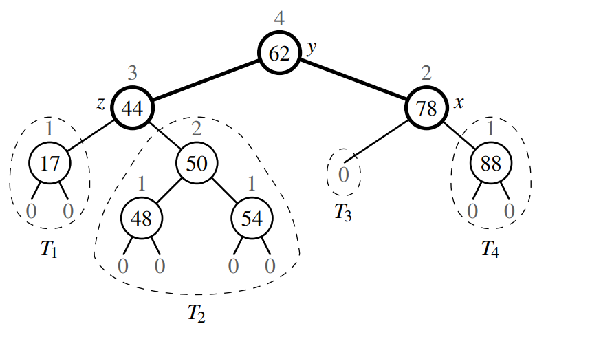

### Insertion

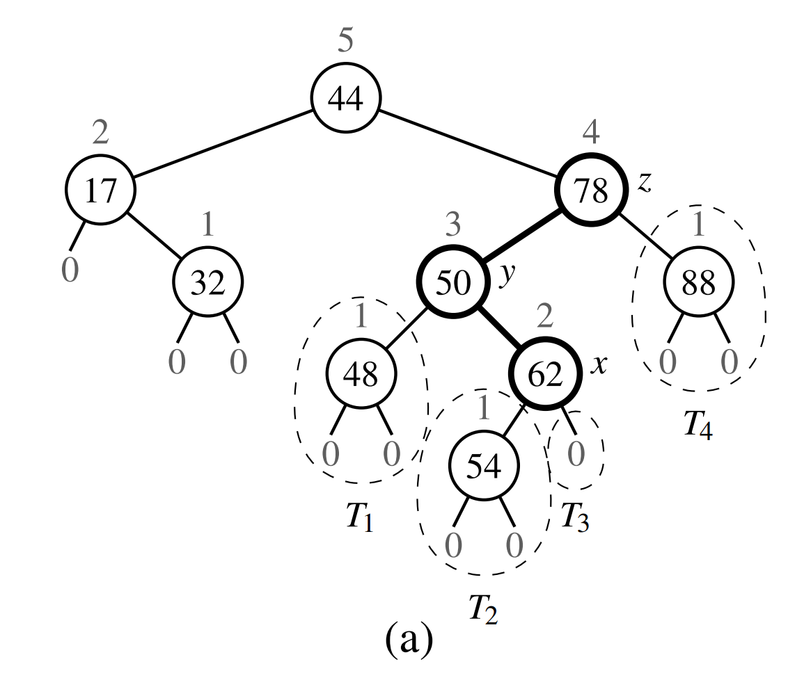

Let's go through the implementation using an insertion example this time. The node with key 54 has been inserted into the tree. So we end up calling `rebalance()` on the position representing the newly inserted node. On each iteration of the while loop, we are walking up the tree, and updating the height of the nodes we encounter. This is why the while loop does not terminate straight away. And it is also why we do not need to explicitly set or recompute the height of nodes in any other method. Once we get to the node containing 78, we enter the `if not self._is_balanced()` condition for the first time. We then do a trinode restructuring with the nodes containing keys 78, 50 and 62 as keys. Since the three nodes are not aligned, two rotations on x will be needed. In the end, x will be the new root of the subtree, with y as its left child, and z as its right child. Node y will have T1 and T2 as its children. Node z will have T4 as its right child. It would also have a left child T3, if T3 was an actual subtree. The heights of x, y and z are then again recalculated after the trinode restructuring. 