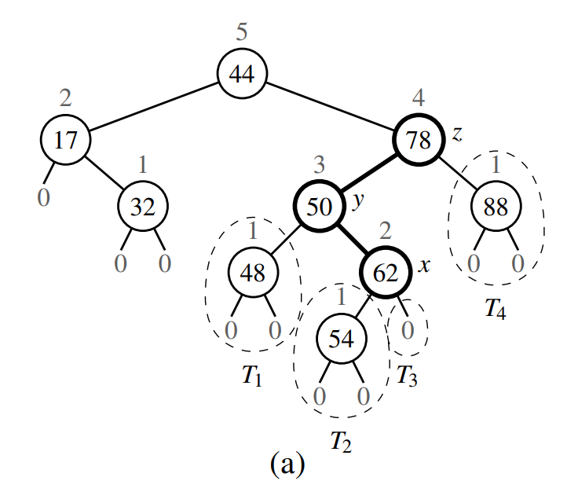
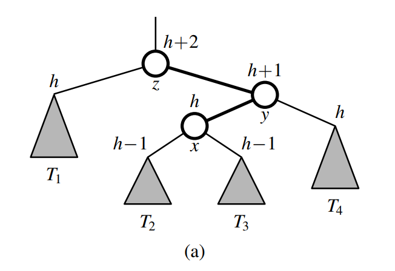
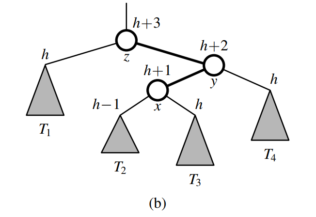
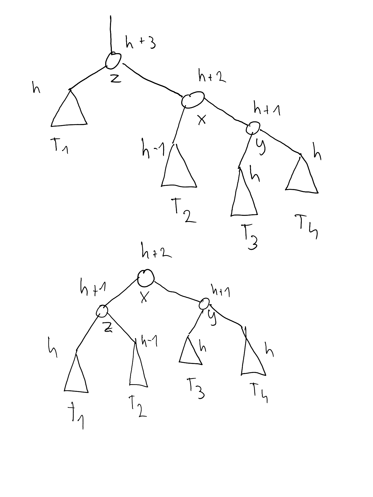

# AVL tree

An AVL tree is a binary search tree which satisfies the height-balance property. Meaning that every position p in the tree has children whose heights differ by at most 1.

## Updating an AVL tree

The challenge is how to update an AVL tree (adding and removing nodes) and still maintain its height-balance property

### Insertion

After insertion, any imbalances that occur can be fixed using a trinode restructuring. But first we need to find the nodes to restructure. In particular, we go up the tree, from the inserted position, until we find the first node with an imbalance, meaning the first node whose children have a difference in height of 2. Note that it must be 2, it cannot be less, since that would not be an imbalance. And it cannot be greater, because then the tree would have already been imbalanced before the insertion. We then designate its child with the greater height as y. This must be the node whose height, before the insertion, was one greater than that of its sibling. And finally, we designate x, again as the child with greater height (though this time it's the child of y). Note that y and z must be ancestor of the newly inserted position p. And x must be either an ancestor, or the newly inserted node itself.

Here's a concrete example of a tree imbalance occuring after an insertion, with x, y and z identified:

And here's a more general/abstract view, of a tree before the insertion:

And after the insertion:

We then do a trinode restructuring, involving two rotations of x:

---

#### Determining heights after rotations

One must be careful when determining the change in heights during a rotation, because it might be a little unintuitive. During a rotation, only the heights of the two swapped nodes can change. The heights of all the other nodes and subtrees are unaffected. By how much they change depends on the particular situation, it is not necessarily always the case that one of the nodes increases by one and the other one decreases by one. To determine the change in heights, its best that we start from the bottom up. For example, if we consider the second rotation in the image above. Before the rotation, z had height `h+3` and x had height `h+2`. The reason that z had height `h+3`, is that it had x as its greater child, and the height of a node is by definition 1 greater than the height of its greater child. After the swap between the two occurs, z has as its children T1 and T2, whose heights are `h` and `h-1`. Their heights could not have been changed by the swaps, because nothing was inserted or otherwise changed in the subtrees rooted at T1 and T2. Therefore, the height of z after the swap must be `h+1`, ie 1 greater than the height of its greater child T1. Now that we know the height 

---

As we can see from the heights of all nodes, the tree is balanced after a single trinode restructuring. And because the height of the root of the subtree (originally z, after the restructuring x) also remains the same at `h+2`, it means that the balance property is also restored globally. Meaning that we could not have caused an imbalance between what was originally z's sibling and this subtree.

### Deletion

Just like for insertion, an imbalance can occur in a binary search tree after a node is deleted. The deletion of a node can decrease its height by one. Again, we deal with the resulting imbalance using a trinode restructuring, but the process is a bit more complex compared to insertion. To identify our three position for restructuring - x, y and z - the first step is the same. We designate as z the first node which has become unbalanced when we walk up the tree from the paren of the deleted position. Node y is then the taller child of z, ie the child of z which is not an ancestor of the deleted node p. Node x is then either the taller child of y, if one exists. Otherwise, in case that the children have the same height, then x is the same side child as y is to z. 

