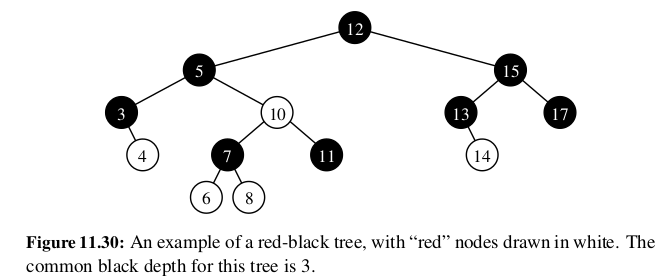
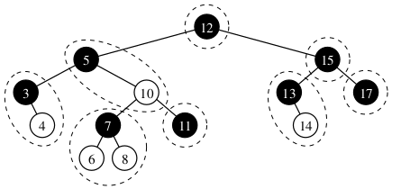
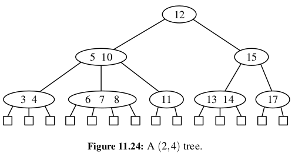

# Red-Black trees

## Intro

Red-black trees are a type of binary search trees, with better performance than both AVL trees and (2, 4) trees. AVL trees and (2, 4) trees, may require many restructure operations after an update - proportional to the height of the tree - which is O(log(n)). On the other hand, red-black trees use O(1) (amortized) structural changes after an update in order to stay balanced. 

### Properties

The tree is called red-black, because each node is 'colored' with one of the two colors. The tree also must satisfy the following properties:

1. Root property: The root of the tree is black
2. Red property: The children of a red node (if any) must be black. Conversely, the parent of a red node must be black.
3. Depth property: All nodes with zero or one children have the same black depth (number of black ancestors). Recall that a node is its own ancestor.

### Relationship to (2, 4) trees

We can make thinking about red-black trees more intuitive by noting an interesting correspondence, or maybe even equivalence, with (2, 4) trees. In fact, a red-black tree can be thought of as just an alternative representation of a (2, 4) tree. 

We can construct the (2, 4) tree from a red-black tree by merging red nodes into their parents. An alternative way to think about this is to consider each black node of a red-black tree as a node in a (2, 4) tree, and each red node as an internal pointer in a (2, 4) tree. This is also consistent with the properties of the tree. The depth property corresponds more or less 1:1. The red property allows us to transform nodes and red children into (2, 4) tree nodes, by guaranteeing a lack of overflows arising from the mergers. Because red children must have a black parent, and obviously in a binary tree, a node can only have two children, the mergers can lead to a node containing at most 3 values (a 4-node), which guarantees that the size property of a 2, 4 tree is maintained during the mergers.

Here's an example:

Obviously, we can therefore also convert any (2, 4) tree into a red-black tree. 