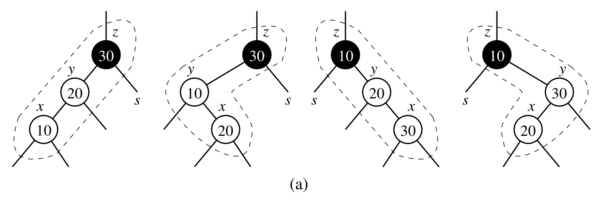
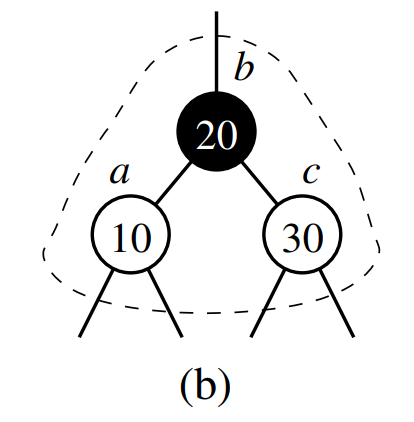
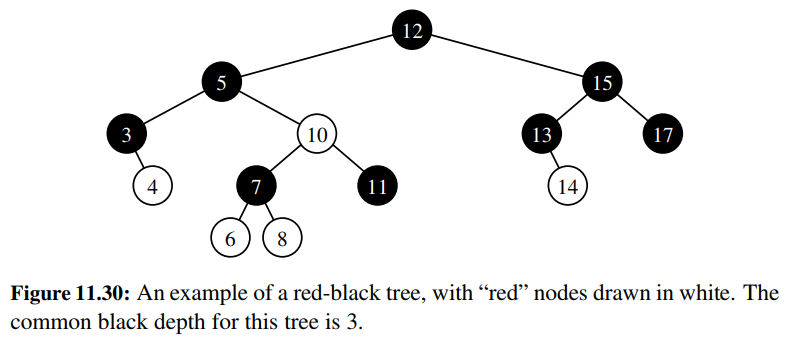
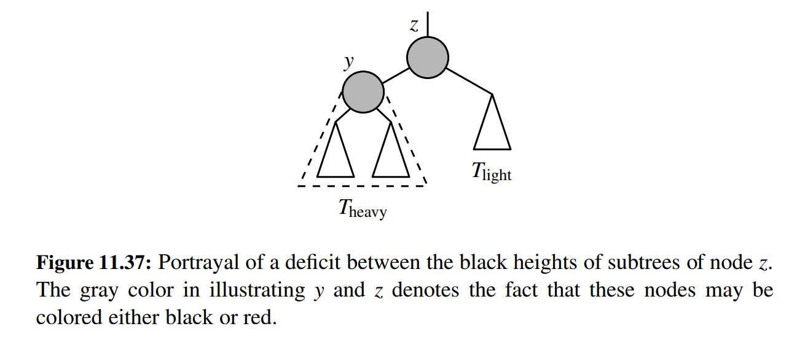
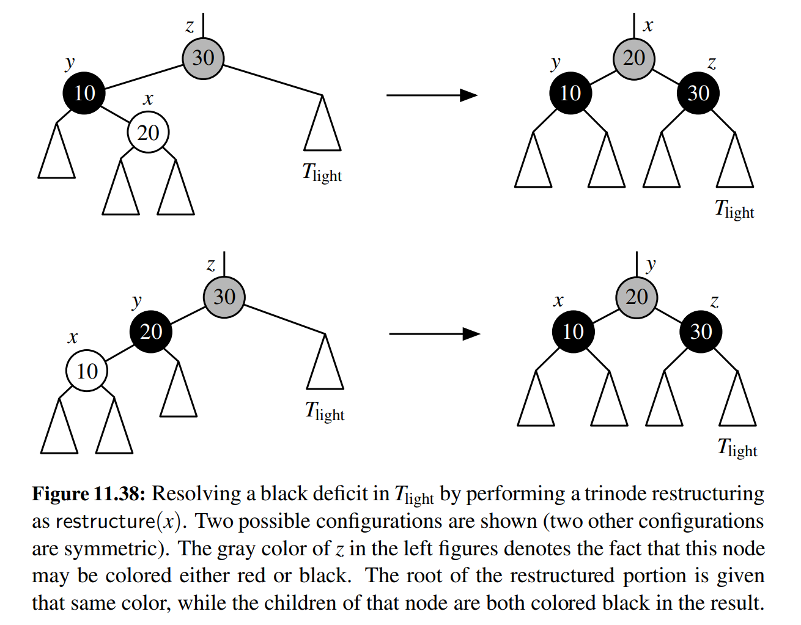
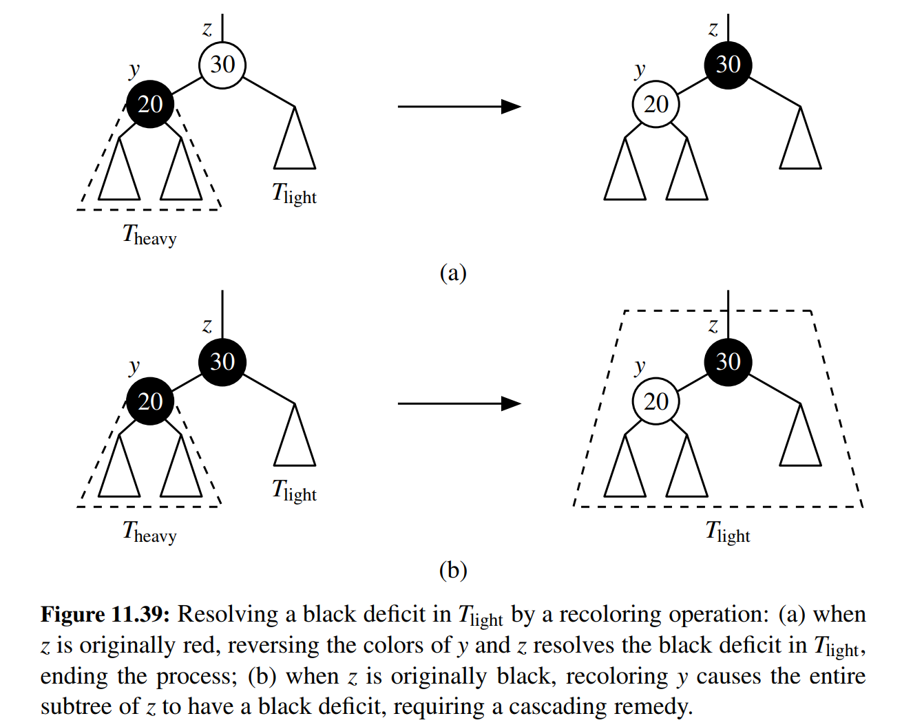
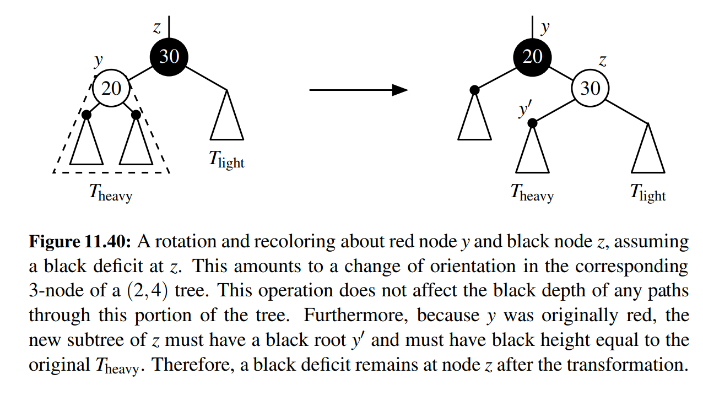

# Red-Black trees

## Intro

Red-black trees are a type of binary search trees, with better performance than both AVL trees and (2, 4) trees. AVL trees and (2, 4) trees, may require many restructure operations after an update - proportional to the height of the tree - which is O(log(n)). On the other hand, red-black trees use a constant number of restructure operations, although the overall complexity of insertions and deletions is still O(log(n)), because recolorings can cascade all the way up the tree. 

### Properties

The tree is called red-black, because each node is 'colored' with one of the two colors. The tree also must satisfy the following properties:

1. Root property: The root of the tree is black
2. Red property: The children of a red node (if any) must be black. Conversely, the parent of a red node must be black.
3. Depth property: All nodes with zero or one children have the same black depth (number of black ancestors). Recall that a node is its own ancestor.

### Relationship to (2, 4) trees

We can make thinking about red-black trees more intuitive by noting an interesting correspondence, or maybe even equivalence, with (2, 4) trees. In fact, a red-black tree can be thought of as just an alternative representation of a (2, 4) tree. 

We can construct the (2, 4) tree from a red-black tree by merging red nodes into their parents. An alternative way to think about this is to consider each black node of a red-black tree as a node in a (2, 4) tree, and each red node as an internal pointer in a (2, 4) tree. This is also consistent with the properties of the tree. The depth property corresponds more or less 1:1. The red property allows us to transform nodes and red children into (2, 4) tree nodes, by guaranteeing a lack of overflows arising from the mergers. Because red children must have a black parent, and obviously in a binary tree, a node can only have two children, the mergers can lead to a node containing at most 3 values (a 4-node), which guarantees that the size property of a 2, 4 tree is maintained during the mergers.

Here's an example:

Obviously, we can therefore also convert any (2, 4) tree into a red-black tree. Again, the analogy of black nodes as tree nodes, and red nodes as internal pointer is helpful. We distinguish between the three different types of nodes in a (2, 4) tree.

1. A 2-node becomes a black node.
2. A 3-node is transformed to a black node and a red node, in a parent-child relationship. It depends on the specific case which one becomes the parent, and which one becomes the child.
3. A 4 node is transformed to a black node with two red children. Obviously the middle k-v pair become the black node, and the two edge k-v pairs become its left and right child, respectively.

## Updating a red-black tree

### Insertions

The first step of an insertion into a red-black tree is the same as inserting into a regular binary tree. Namely we search down the tree, until we reach an external node, having failed in our search. We will then insert the new key-value pair as either the left or right child of this external node. The question is what color the newly inserted node is going to be. When inserting into an originally empty tree (ie we are setting the root), we color the node black, to obey the root property. In all other cases, we color the newly inserted node red. By following this rule, we have definitely maintained the root property, as well as the depth property. By adding a new red node (particularly as an external node) we have not changed the black depth of any existing nodes in the tree. However, we might have violated the red property of the tree. Let's denote as x the node that we have just inserted, its parent as y, and its grandparent as z. If y is a red node, then we now have a red node with a red node as its child, thereby violating the red property. This violation is called a double red. We disinguish between two cases in dealing with a double red. 

1. The sibling of **y** is either black or `None`

In this case, using the (2, 4) tree analogy, we have inserted a new k-v pair into a 3-node. The grandparent z is a black node, and has one red child, making it an equivalent of a 3-node. We have now inserted another red node, but as a grandchild of z, while we actually want it to be a child of z. This would then make it a legitimate 4-node (equivalent). At this point, one should be thinking of the way to rectify this problem, since we have three nodes - x, y and z - in a child-parent-grandparent relationship, but would like them to be in a just a child-parent-child relationship. Of course, we are going to use a trinode restructuring to fix the situation.

These are the possible configurations after inserting, before restructuring.

And of course, a trinode restructuring, either via one or two rotations, depending on the nodes' alignment, will get us to the desired outcome:

2. The sibling of y is red 

This case is directly analogous to an overflow after an insertion into a (2, 4) tree. Before the insertion, we have a black node with two red children, the equivalent of a 4-node. We then add a red grandchild to one of the red children which results in an 'overflow'. 

We solve this by doing a 'recoloring'. Namely, we change the colors of y and s to black, and their parent z to red (unless z is the root). Note that in doing so, we have preserved the depth property, as well as the root property. Because if we go down this part of the tree, we still only encounter one black node. Previously, it was z, now it's one of its children, y or s. However, we may violate the red property. Because z has changed color from black to red, if its parent is a red node, we have created a double red. If that is the case, we continue going up the tree, performing recolorings. Until we finally solve the issue with a final recoloring or trinode restructuring.

### Deletions

During a deletion from a red-black tree, we always remove a node which has at most one child. This is the same as with a regular binary tree, in the case where we need to remove a node with two children, we swap it with its inorder predecessor, and then remove. 

The simplest case is removing a red. After removing a red node, the black depth of any path in the tree does not change. And we also could not have created a double red by this removal. So the tree remains a valid red-black tree. This corresponds to the removal of a key-value pair from a 3-node or 4-node from a (2, 4) tree. 

Another relatively simple case is the removal of a black node with a single red child. In this case, the black node is removed, its red child takes its place, and we then recolor to black. This ensures that the tree remains a valid red-black tree.

A more difficult case is when a black leaf node is removed. This corresponds to the removal of a 2-node from a (2, 4) tree. Let's look at an example tree:

Let's say we remove node 17. The problem is that now the parent of the removed black leaf node, in this case node 15, becomes a node with a single child. And any nodes with zero or one children must have the same depth. After we remove 17 though, obviously node 15 does not have the same black depth as all the other nodes in the tree which have zero or one children. The sibling of the removed node must have a subtree with black height 1. Let's look at a general depiction of this situation, in other to distinguish between the different cases:

In the above depiction, z is the parent of the deleted node. And in case of deletion of a black leaf, T light is trivially the empty subtree that remains after the deletion. The black depth of T heavy is exactly one greater than that of T light. And we let y denote the root of T heavy. Note that such a node must exist, due to the fact that the black depth of T heavy is at least one. We now consider three possible cases:

1. Node y is black and has a red child x

In this case, we perform a trinode restructuring, and then recolor the nodes:

Note that this case is equivalent to performing a transfer operation in a (2, 4) tree after a deletion. The fact that y has a red child indicates that it corresponds to a 3-node or 4-node in a (2, 4) tree. Which is the condition under which we perform a transfer operation. And if we follow the movement of the nodes, we can notice the equivalence. During a transfer operation in a (2, 4) tree, a key-value pair is moved from the sibling to the common parent, and then from the parent to the node made empty by the removal.

In terms of keeping the tree as a valid red-black tree, by doing the trinode restructuring, and recoloring the nodes, we increase the black depth of the T light subtree by one, while keeping the black depth of the T heavy subtree the same. Thereby balancing the black depths between the two subtrees.

2. Node y is black, and both children of y are either black or None

In this case, we do a recoloring, but we may not be done after the single recoloring. We consider two cases, where either z is red and y is black, or both z and y are black.

In the first case, we can simply swap the colors of y and z, such that z becomes a black node, and y a red node. Then, we are actually done. This swapping of colors increases the black depth of T light by one, and keeps the black depth of T heavy the same. So the black depths are now balanced. Also note that since both children of y are either black or None, we could not have introduced a double red through the recoloring.

In the second case, we simply color y red. Again, this can't introduce a double red. And it reduces the black depth of T heavy by one, meaning that it now has the same black depth as T light. However, the whole subtree rooted at z, containing both T heavy and T light now has a black depth deficit. We need to repeat the consideration of the three cases at the parent of z as a remedy.

This corresponds to a fusion operation in a (2, 4) tree to remedy an underflow. In that case, we can also have a cascading effect, since a key-value pair is moved from the parent node, which can cause another underflow.

3. Node y is red

Because node y is red, it must mean that node z is black (otherwise there would have been a double red). And for the same reason, the children of y must be black. The subtrees of y must also have black depth that's equal to the black depth of the whole T heavy subtree. In this case, we do a rotation of the two nodes y and z, and recolor them:

However, this now leads to a black deficit at node z. We reapply either Case 1 or Case 2 to remedy this deficit.

