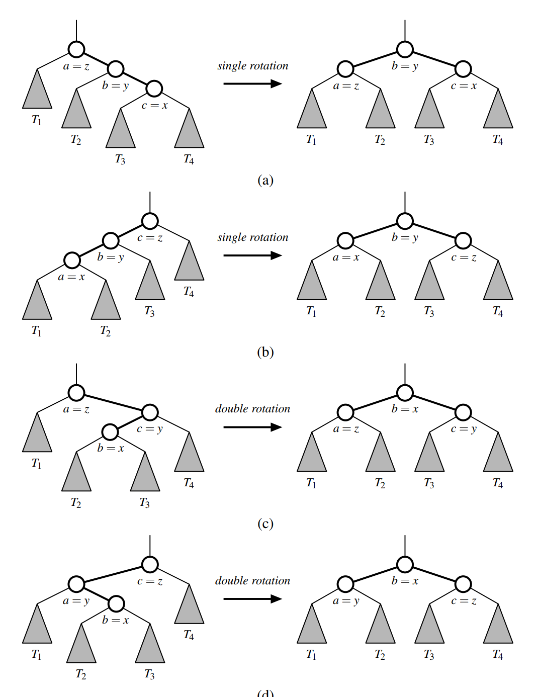

# Trinode restructuring

Trinode restructuring is a compound operation, combining one or more rotations, to rebalance three nodes (initially in a child-parent-grandparent relationship) and their subtrees, as to reduce the path length to the child node and its subtrees.

## Rotation

As mentioned, the core operation of a trinode restructuring is a 'rotation'. Personally, I think it's a bit of a misnomer, because you can't get from the configuration before a rotation to the configuration after the rotation by actually rotating the elements. Nevertheless, during a rotation, either a left child or a child of a given node move up to replace the parent node, with the remaining subtrees also moving around. The result is that the depth of one of the subtrees decreases by one, and the depth of one of the other subtrees increases by one.


We can distinguish between the two operations as a right rotation, and a left rotation, though there is inconsistency in how these are applied. For our purposes, a right rotation occures when the left child replaces the parent, and the parent then becomes the right child. During this operation, the depth of the original parent node, and its right subtree increases by one. The depth of the original left child and its left subtree decreases by one. An alternative way to identify which heights are changing is to realize that the two parent-child nodes (x and y) 'swap heights', as the depth of one of them increases, and for the other one it decreases. And then the subtree containing values which are all less than both of the nodes (T1 in the image), and the subtree containing values greater than all of the nodes (T3 in the image) also change in height by one. On the other hand, the subtree containing values between x and y (T2 in the image) does not change in height. Another reminder of how the nodes/subtrees move around is that the inorder traversal order obviously cannot change, otherwise the tree would violate the order property after the rotation.

## Trinode restructuring

A trinode restructuirng is a compound operation, consisting of one or two rotations. It takes three nodes: node x, its parent y, and its grandparent z, and rearranges them in order to reduce the depth of x and its subtrees. There are 4 possible arrangements for three nodes in this kind of relationship. x can be either a left or right child, and then y can be either a left or right child, giving us 2 * 2 = 4 configurations:



A pseudocode algorithm:

```
Algorithm restructure(x):

Input: A position x of a binary search tree T that has both a parent y and a grandparent z

Output: Tree T after a trinode restructuring (which corresponds to a single or double rotation) involving positions x, y, and z

1: Let (a, b, c) be a left-to-right (inorder) listing of the positions x, y (parent of x), and z (parent of y), and let (T1,T2,T3,T4) be a left-to-right (inorder) listing of the four subtrees of x, y, and z not rooted at x, y, or z.

2: Replace the subtree rooted at z with a new subtree rooted at b. Meaning, relink the connection which exists between z and its parent, such that the parent of z becomes the parent of b instead.

3: Let a be the left child of b and let T1 and T2 be the left and right subtrees of a, respectively.

4: Let c be the right child of b and let T3 and T4 be the left and right subtrees of c, respectively
```

The result of a trinode restructuring is that depth of x and its subtrees is reduced. In the case of same alignment between x, parent and grandparent, its depth is reduced by one. In case of opposite alignment, it is reduced by two. The depth of z increases by one. The depth of y decreases in the case of same algnment, and stays the same in case of opposite alignment.